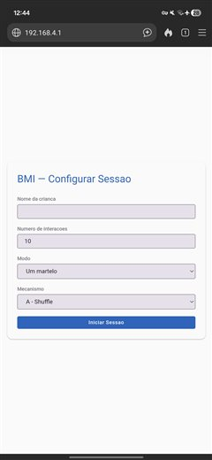
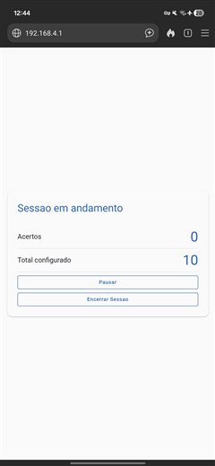
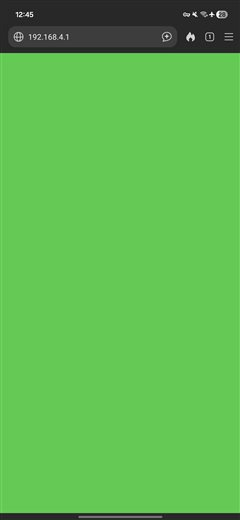
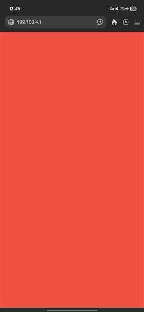
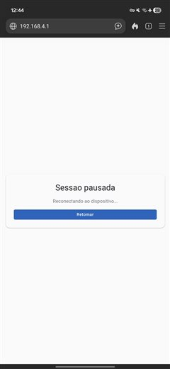
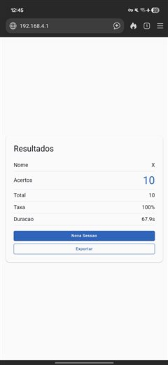
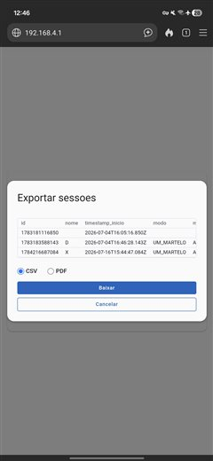

# Instrumento Lúdico-Pedagógico — ESP32

> **Aviso:** este instrumento não foi testado nem validado cientificamente, e não substitui nem é equivalente a instrumentos de avaliação padronizados já existentes. Se qualquer parte deste projeto citar autor, teoria ou referência científica, trate como não validado até prova em contrário. Não deve ser usado para diagnóstico clínico formal. Posicionamento completo: [`concept/escopo_e_limitacoes.md`](concept/escopo_e_limitacoes.md).

[](LANCAMENTO.md)
[](LICENSE)
[](system/01_arquitetura.md)
[](firmware/platformio.ini)
[](firmware/test/)
[](VALIDATION.md)

Uma mesa de jogo para avaliar coordenação motora e reconhecimento de cores em crianças de 5 anos. Uma luz acende mostrando uma cor; a criança bate com o martelo de madeira ou com a própria mão na zona daquela cor; o pedagogo acompanha tudo pelo navegador do celular — sem instalar aplicativo, sem internet, sem os dados saírem do aparelho.

Apesar do formato de brinquedo, cada sessão gera um registro completo — identificador, nome da criança, data e hora de início, modo, mecanismo de sorteio, interações configuradas, acertos, erros, taxa de acerto e duração — exportável em planilha (CSV) ou relatório (PDF) para acompanhar o desenvolvimento da criança ao longo do tempo. Os autores do projeto não se responsabilizam por uso indevido.

---

## O brinquedo

> **[VÍDEO — a inserir]**
> *Vídeo de demonstração do protótipo em uso — a publicar nas redes sociais do projeto e linkar aqui.*

> As duas fotos do protótipo físico abaixo foram ajustadas com ferramenta de inteligência artificial (Gemini) para composição visual — a edição é só de apresentação da imagem, não afeta o funcionamento real do brinquedo.

> 
> *Vista geral: mesa com as 4 zonas coloridas, luzes indicadoras.*

> 
> *Vista lateral*

### Interface do pedagogo

Capturas de tela reais do navegador do celular, sem edição, mostrando as principais telas de uma sessão — da configuração até a exportação dos dados:

|  |  |  |  |
|:---:|:---:|:---:|:---:|
| <a href="imagens/tela_inicial.jpg"></a> | <a href="imagens/tela_sessao_iniciada.jpg"></a> | <a href="imagens/tela_acerto.jpg"></a> | <a href="imagens/tela_erro.jpg"></a> |
| Configurar Sessão | Sessão Iniciada | Feedback de Acerto | Feedback de Erro |

|  |  |  |  |
|:---:|:---:|:---:|:---:|
| <a href="imagens/tela_sessao_andamento.jpg"></a> | <a href="imagens/tela_pausa.jpg"></a> | <a href="imagens/tela_resultados.jpg"></a> | <a href="imagens/tela_exportar.jpg"></a> |
| Sessão em Andamento | Sessão Pausada | Resultados Finais | Exportar Sessões |

---

## Como funciona

- **4 zonas coloridas** (laranja, azul, amarelo e roxo — paleta acessível para daltonismo): a criança bate no taco de madeira de cada zona, com o martelo ou com a mão, e um sensor na zona capta o impacto.
- **3 luzes** acima das zonas mostram a cor-alvo de cada rodada de estímulo.
- **Dois modos:** com 1 martelo ou a mão (público principal, 5 anos) ou com 2 martelos (ou as duas mãos) simultâneos (coordenação bimanual, público estendido — a critério do profissional).
- **O celular do pedagogo é o painel de controle:** o aparelho se conecta à rede WiFi criada pelo próprio brinquedo e abre a interface no navegador. Tela verde no acerto, vermelha no erro; a criança vê só as luzes — nunca a pontuação.
- **Fim de sessão sempre festivo:** as luzes celebram independentemente do desempenho. O resultado objetivo fica apenas com o profissional.

## Para usar

- **[Manual de uso](manual/12_manual_pedagogo.md)** — passo a passo em linguagem simples: ligar, conectar, configurar a sessão, conduzir, ler os resultados e exportar.
- **[Privacidade e dados das crianças](compliance/06_privacidade_lgpd.md)** — o que é registrado, onde fica e quais são os direitos dos responsáveis (LGPD), escrito para ser entregue às famílias.

O uso é sempre supervisionado por profissional habilitado. O instrumento não se destina a uso doméstico sem orientação pedagógica.

---

## Estado do projeto

O desenvolvimento segue o V-model: cada linha de firmware é rastreável a um documento de especificação, e cada documento ao conceito.

Sobre como a inteligência artificial foi usada nesse processo — o que ela fez, onde foi deliberadamente limitada e por quê — veja [`.claude/IA_USO.md`](.claude/IA_USO.md).

| Marco | Status |
|---|---|
| Documentação (conceito → hardware) | Aprovada — `v0.1.0` |
| Especificações JSON + schemas | Concluídas — `v0.2.0` |
| Firmware (4 módulos) | Concluído — `v0.3.0`, 42/42 testes, compilação sem warnings |
| Validação com hardware físico | **Em andamento** — [checklist de validação](VALIDATION.md) |
| Release `v1.0.0` | Após todos os critérios de aceitação passarem |

---

## Para desenvolvedores

Hardware: ESP32 DevKitC (WROOM-32), 4 discos piezoelétricos como sensores de impacto, 3 LEDs WS2812B, alimentação 12V → LM2596 a 3.3V. Firmware C++/PlatformIO em 4 módulos (sensor, visual, jogo, interface WiFi); interface HTML/CSS/JS embutida no firmware, servida por Access Point próprio.

### Pré-requisitos

- Python 3.11+
- PlatformIO CLI
- MinGW-w64 (para os testes nativos no Windows)

### Comandos

```bash
# Verificar integridade da documentação (links, versões, rastreabilidade)
python scripts/run_all.py

# Compilar o firmware
cd firmware && pio run

# Testes unitários sem hardware
cd firmware && pio test -e native

```

### Como o repositório se organiza

Comece por [`CLAUDE.md`](CLAUDE.md) (guia de procedimentos do V-model) e [`concept/00_conceito.md`](concept/00_conceito.md) (fonte única de verdade). Nenhuma mudança é feita sem derivar de um documento aprovado.

| Documento | Conteúdo |
| --- | --- |
| [`concept/00_conceito.md`](concept/00_conceito.md) | Glossário, modos, regras, timings, fundamentos pedagógicos |
| [`concept/escopo_e_limitacoes.md`](concept/escopo_e_limitacoes.md) | O que o 42 é e não é, honestamente — sem validação científica, campo aberto para pesquisa futura |
| [`system/01_arquitetura.md`](system/01_arquitetura.md) | Stack, módulos, GPIOs, RNFs, critérios de aceitação |
| [`modules/sensor/02_sensor_impacto.md`](modules/sensor/02_sensor_impacto.md) | Piezo, circuito de proteção, threshold, debounce |
| [`modules/visual/03_saida_visual.md`](modules/visual/03_saida_visual.md) | WS2812B, cores, animações |
| [`modules/game/04_logica_jogo.md`](modules/game/04_logica_jogo.md) | Aleatoriedade, máquina de estados, score |
| [`modules/power/05_alimentacao.md`](modules/power/05_alimentacao.md) | Cadeia de alimentação, orçamento de corrente, decoupling |
| [`compliance/06_privacidade_lgpd.md`](compliance/06_privacidade_lgpd.md) | LGPD Lei 13.709/2018 — dados de crianças |
| [`modules/interface/07_interface_pedagogo.md`](modules/interface/07_interface_pedagogo.md) | Interface web, WebSocket, localStorage, exportação CSV/PDF com prévia |
| [`hardware/08_bom.md`](hardware/08_bom.md) | BOM completa com part numbers |
| [`hardware/09_conexoes.md`](hardware/09_conexoes.md) | Esquemático, mapeamento de pinos, shield |
| [`hardware/10_cablagem.md`](hardware/10_cablagem.md) | Fios, bitolas, comprimentos |
| [`hardware/11_montagem.md`](hardware/11_montagem.md) | Ordem de montagem, fixação, testes por etapa |
| [`manual/12_manual_pedagogo.md`](manual/12_manual_pedagogo.md) | Manual de uso — linguagem não-técnica |
| [`spec/`](spec/) | Especificações JSON + schemas derivados dos documentos |
| [`_governance/`](_governance/) | Padrões: documentação, firmware C++, testes Unity, HTML/CSS/JS |
| [`VALIDATION.md`](VALIDATION.md) | Checklist formal de validação (ETAPA 8) |

---

## Licença

GPL-3.0 — consulte [`LICENSE`](LICENSE).

