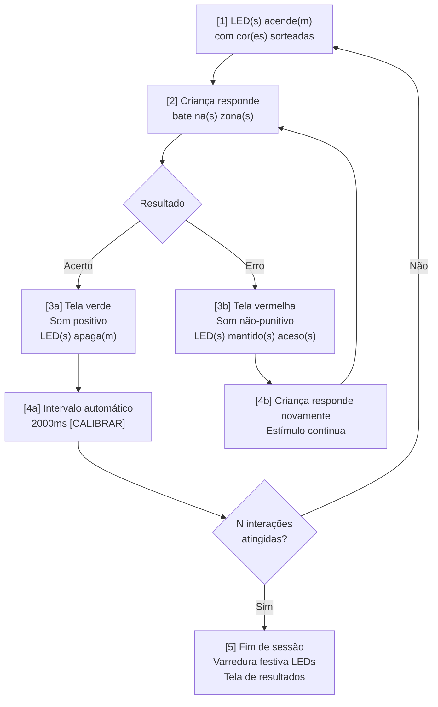

# 00_CONCEITO.md — Projeto [NOME A DEFINIR]

---

## 1. Identificação do Projeto 

| Campo | Valor |
|---|---|
| Nome provisório | A definir |
| Tipo | Instrumento lúdico-pedagógico com microcontrolador |
| Finalidade | Estímulo e avaliação de coordenação motora e discriminação visual por cor |
| Público principal | Crianças de 5 anos em desenvolvimento típico |
| Público estendido | Crianças com altas habilidades, superdotação ou neurodivergência de alto rendimento |
| Contexto de uso | Ambiente pedagógico supervisionado por profissional habilitado |

---

## 2. Objetivo do Documento 

Definir de forma determinística e fechada o conceito do projeto: o que é, para quem serve, como funciona e quais são as regras. Este é o documento raiz do projeto. Toda decisão técnica, de firmware ou de interface deve ser rastreável a uma seção deste documento.

---

## 3. Contexto e Justificativa 

O projeto nasce da necessidade de um instrumento de estímulo e avaliação motora para crianças na faixa pré-escolar que combine robustez técnica, fundamentação pedagógica e baixo custo de produção local.

O Simon Says comercial (Hasbro, 1978) é o produto mais próximo conceitualmente, mas não oferece: interface de controle para o pedagogo, registro de sessão, exportação de dados, modos adaptados a neurodivergência de alto rendimento, nem rastreabilidade clínica. Este projeto preenche essas lacunas.

A construção justifica-se mesmo com custo similar ao produto comercial porque o resultado é um **instrumento de avaliação com shell de brinquedo** — categoria distinta de um brinquedo comercial.

---

## 4. Glossário 

Termos com significado específico neste projeto. O uso de sinônimos não listados é proibido nos documentos técnicos.

| Termo | Definição |
|---|---|
| **Sessão** | Conjunto de N interações configurado pelo pedagogo antes do início |
| **Interação** | Ciclo completo: estímulo → resposta da criança → resultado exibido |
| **Tentativa** | Sinônimo formal de interação, usado em contexto de score |
| **Rodada** | Termo proibido neste projeto — ambíguo entre interação e sessão |
| **Estímulo** | Estado em que um ou mais LEDs estão acesos aguardando resposta correta |
| **Acerto** | Resposta correta que encerra o estímulo e avança o contador |
| **Erro** | Resposta incorreta que mantém o estímulo ativo |
| **Janela de simultaneidade** | Intervalo máximo tolerado entre o primeiro e o segundo impacto no Modo 2 |
| **Zona ativa** | Zona de cor cuja cor corresponde a um LED aceso no momento |
| **Zona inativa** | Zona de cor sem LED correspondente aceso no momento |

---

## 5. Público-Alvo 

### 5.1 Público principal 
- Faixa etária: 5 anos
- Desenvolvimento: típico
- Pré-requisito motor: coordenação unimanual estabelecida
- Pré-requisito cognitivo: discriminação de cores estabelecida
- Base teórica: estágio pré-operacional (Piaget), capacidade atencional de 3–4 itens (Cowan, 2001)

### 5.2 Público estendido 
- Crianças com altas habilidades, superdotação ou neurodivergência de alto rendimento
- Habilidade adicional avaliada: coordenação bimanual
- Critério de acesso ao modo estendido: avaliação exclusiva do pedagogo responsável
- Sem critério automático de promoção entre modos

### 5.3 Explicitamente fora de escopo (v1.0) 
- Crianças com déficit motor significativo
- Uso sem supervisão de profissional habilitado
- Uso doméstico sem orientação pedagógica
- Qualquer uso clínico formal sem adaptação e validação específica

---

## 6. Componentes Físicos 

### 6.1 Zonas de impacto 
- 4 zonas de cor fixas, visualmente distintas e claramente delimitadas
- Cores definidas: **Laranja, Azul, Amarelo, Roxo**
- Paleta selecionada com base em acessibilidade para os tipos mais comuns de daltonismo
- Referência de paleta: Wong, B. (2011). *Nature Methods*, 8(6), 441. (Q1)
- Cada zona contém um sensor de impacto: disco piezoelétrico simples (disco cerâmico com dois fios, sem placa eletrônica)
- **Isolamento físico obrigatório entre zonas:** vibração propaga através de superfícies contínuas e pode disparar sensor de zona adjacente. Cada zona é um módulo fisicamente separado, com gap de ar ou material isolante (borracha/cortiça) entre elas. Uma superfície única e contínua é inviável.

### 6.2 Indicadores LED 
- 3 LEDs WS2812B individuais e endereçáveis, posicionados em conjunto separado acima das zonas
- Separação espacial obrigatória entre zona indicadora (LEDs) e zona de impacto (cores)
- **LED central:** ativo exclusivamente no Modo 1 Martelo
- **LED esquerdo:** ativo exclusivamente no Modo 2 Martelos
- **LED direito:** ativo exclusivamente no Modo 2 Martelos
- Cada LED pode exibir qualquer uma das 4 cores do sistema

### 6.3 Martelos 
- 1 ou 2 martelos de madeira
- Completamente passivos: sem sensores, sem LEDs, sem fios
- Robustez mecânica para uso por crianças de 5 anos
- O sensor de impacto está na zona de impacto, não no martelo

### 6.4 Microcontrolador 
- ESP32 DevKit
- Responsabilidades: leitura dos sensores piezo, controle dos 3 LEDs, servidor web via hotspot, lógica de jogo
- Especificação detalhada: [VER: 01_arquitetura.md#stack-tecnologico]

### 6.5 Energização 
- Fonte de alimentação direta (rede elétrica)
- Sem bateria na v1.0
- Especificação detalhada: [VER: 05_alimentacao.md#cadeia-alimentacao]

---

## 7. Modos de Operação 

### 7.1 Modo 1 Martelo (principal) 
- Um único martelo em uso
- LED central acende exibindo a cor-alvo
- Criança deve identificar e bater na zona da cor correspondente
- Indicado para: público principal (5 anos, desenvolvimento típico)

### 7.2 Modo 2 Martelos (estendido) 
- Dois martelos em uso simultâneo
- LED esquerdo e LED direito acendem simultaneamente
- As duas cores exibidas são **sempre distintas entre si**
- Criança deve bater nas duas zonas correspondentes dentro da janela de simultaneidade
- Indicado para: público estendido
- Seleção: exclusivamente via interface do pedagogo, antes de iniciar a sessão
- Não há troca de modo durante sessão ativa

### 7.3 Estado de boot 
- Ao ligar, antes de qualquer conexão do pedagogo: ciclo de varredura nos 3 LEDs individuais percorrendo as 4 cores do sistema em sequência
- Indica: sistema inicializado e aguardando conexão
- Especificação de timing: [VER: 03_saida_visual.md#boot-animation]

---

## 8. Fluxo de uma Interação 

---

## 9. Regras do Sistema 

### 9.1 Definição de acerto 
- Modo 1: criança bate na zona cuja cor corresponde ao LED central aceso
- Modo 2: criança bate nas duas zonas corretas dentro da janela de simultaneidade

### 9.2 Definição de erro 
- Bater em zona inativa: erro
- Bater na zona de cor errada: erro
- Modo 2 — acertar uma zona e errar a outra: erro
- Modo 2 — acertar as duas zonas fora da janela de simultaneidade: erro

### 9.3 Tratamento de erro 
- Estímulo é mantido (LEDs permanecem acesos)
- Feedback não-punitivo no dispositivo do pedagogo
- Criança tenta novamente o mesmo estímulo
- Não há limite de tentativas por interação

### 9.4 Contagem de score 
- Uma interação = um ciclo completo encerrado por acerto
- Erros intermediários dentro da mesma interação não contam individualmente no score
- Score exibido: acertos / interações totais / taxa percentual

### 9.5 Dois timings distintos — não confundir 

**Timing A — Tempo de resposta** (estímulo → primeira batida)
- Sem limite. A criança vê o estímulo e responde quando consegue.
- Aplica-se a ambos os modos.

**Timing B — Janela de simultaneidade** (primeira batida → segunda batida)
- Exclusivo do Modo 2 Martelos.
- Não é tempo de reação. É a tolerância entre os dois impactos após a criança iniciar a resposta.
- Valor padrão: **800ms** [CALIBRAR]
- Configurável via interface do pedagogo antes de iniciar sessão
- Referências: Swinnen (2002) *Nature Reviews Neuroscience* Q1; Corbetta & Thelen (1996) *JEPHPP* Q1

### 9.6 Aleatoriedade 
- **Mecanismo A — Shuffle por bloco:** 4 cores embaralhadas e percorridas em sequência completa antes de repetir. Distribuição uniforme garantida. Indicado para uso padrão.
- **Mecanismo B — Peso decrescente:** probabilidade de cada cor diminui conforme recência de exibição. Mais natural, menos previsível. Indicado para público estendido.
- Seleção do mecanismo: via interface do pedagogo antes de iniciar sessão
- Modo 1: mesma cor pode aparecer em interações consecutivas
- Modo 2: as duas cores exibidas simultaneamente são sempre distintas entre si
- Especificação dos algoritmos: [VER: 04_logica_jogo.md#aleatoriedade]

### 9.7 Intervalo entre interações 
- Valor padrão: **2000ms** automático após acerto [CALIBRAR]
- Referências: Ruff & Lawson (1990) *Developmental Psychology* Q1; Kail (1991) *Psychological Bulletin* Q1

---

## 10. Feedback 

### 10.1 Feedback de acerto 
- Dispositivo do pedagogo: tela completamente verde
- Som: positivo — especificado em [VER: 07_interface_pedagogo.md#feedback-sonoro]
- LEDs da mesa: apagam imediatamente

### 10.2 Feedback de erro 
- Dispositivo do pedagogo: tela completamente vermelha
- Som: não-punitivo, referencial (ex: tuc tuc madeira)
- LEDs da mesa: mantidos acesos
- Caráter: advertivo, não punitivo, não eliminatório

### 10.3 Feedback de fim de sessão 
- **Criança (LEDs da mesa):** varredura festiva nos 3 LEDs percorrendo as 4 cores (~3s), sempre celebratória, independente do score
- **Pedagogo (interface):** tela de resultados completa [VER: 07_interface_pedagogo.md#tela-resultados]
- Fundamentação: instrumentos de avaliação pediátrica não expõem score à criança para evitar associação negativa com o instrumento

### 10.4 Responsabilidade do feedback 
- Feedback sonoro e tela verde/vermelha: dispositivo móvel do pedagogo
- LEDs: controlados pelo ESP32
- Redução deliberada de pontos de falha de hardware

---

## 11. Interface do Pedagogo 

### 11.1 Conectividade 
- ESP32 em modo Access Point (hotspot próprio)
- Acesso via browser nativo, sem instalação de aplicativo
- Operação offline — sem dependência de rede externa
- Idioma: Português brasileiro
- Especificação completa: [VER: 07_interface_pedagogo.md#identificacao]

### 11.2 Configuração pré-sessão 
- Nome da criança (obrigatório)
- Número de interações N
- Modo: 1 Martelo / 2 Martelos
- Mecanismo de aleatoriedade: A / B
- Janela de simultaneidade (visível apenas no Modo 2): padrão 800ms [CALIBRAR], com instrução clara ao pedagogo

### 11.3 Desconexão durante sessão 
- ESP32 pausa o jogo automaticamente
- Estado da sessão é preservado
- Ao reconectar: interface retoma do ponto de pausa

### 11.4 Encerramento antecipado de sessão 
- O pedagogo pode encerrar a sessão ativa antes de completar as N interações configuradas
- Os acertos e o tempo decorrido até o momento do encerramento são preservados e tratados como resultado final da sessão — mesmo fluxo do fim de sessão natural (varredura festiva nos LEDs, tela de resultados, registro em localStorage)
- Após o encerramento, uma nova sessão pode ser iniciada imediatamente, sem recarregar a página do browser nem reiniciar o ESP32
- Especificação completa: [VER: 07_interface_pedagogo.md#tela-sessao-ativa]

---

## 12. Gestão de Dados 

### 12.1 Armazenamento 
- localStorage do browser no dispositivo do pedagogo
- Persistente entre sessões
- Estrutura mínima por sessão: nome da criança, timestamp de início, modo, mecanismo de aleatoriedade, N configurado, acertos, erros, taxa, duração
- Especificação completa: [VER: 07_interface_pedagogo.md#armazenamento-dados]

### 12.2 Exportação 
- Formatos: CSV com cabeçalho (para planilha) e PDF (relatório legível, com data/hora de geração e todos os dados de sessão)
- Escolha do formato no momento da exportação
- Pré-visualização dos dados com confirmação obrigatória antes de qualquer download
- Acionado manualmente pelo pedagogo
- Especificação completa: [VER: 07_interface_pedagogo.md#exportacao-csv]

### 12.3 Responsabilidade sobre os dados 
- Dados residem exclusivamente no dispositivo do pedagogo
- ESP32 não armazena nenhum dado de sessão
- A instituição é integralmente responsável pela guarda e uso dos dados
- [VER: 06_privacidade_lgpd.md#identificacao]

---

## 13. Fundamentos Pedagógicos e Técnicos 

| # | Decisão | Fundamentação | Referência |
|---|---|---|---|
| 1 | 4 zonas de cor | Limite da memória de trabalho em pré-escolares | Cowan (2001) *Behavioral and Brain Sciences* Q1 |
| 2 | Paleta de cores | Acessibilidade para daltonismo | Wong (2011) *Nature Methods* Q1 |
| 3 | Manutenção do estímulo pós-erro | SD mantido até resposta correta (ABA) | Literatura de correção de erros em discriminação |
| 4 | Fim de sessão celebratório | Separação entre experiência afetiva e dado objetivo | Padrão em avaliação pediátrica |
| 5 | Coordenação bimanual no Modo 2 | Habilidade que matura após unimanual | Swinnen (2002) *Nature Reviews Neuroscience* Q1 |
| 6 | Janela de 800ms [CALIBRAR] | Ponto médio de 500–1200ms suportado na literatura | Corbetta & Thelen (1996) *JEPHPP* Q1 |
| 7 | Intervalo de 2000ms [CALIBRAR] | Janela de 1500–2500ms para processamento em 5 anos | Ruff & Lawson (1990) *Developmental Psychology* Q1 |
| 8 | Mecanismo B para público estendido | Processamento preditivo hipereficiente em neurodivergência | Pellicano & Burr (2012) *Trends in Cognitive Sciences* Q1 |
| 9 | Sem limite de tempo por interação | Pressão temporal é contraproducente para 5 anos | Kail (1991) *Psychological Bulletin* Q1 |

---

## 14. Privacidade e LGPD 

Dados nominais de crianças menores de 18 anos em contexto pedagógico exigem:
- Documento de privacidade em linguagem acessível para responsáveis legais
- Design de coleta mínima
- Responsabilidade institucional explícita

Documento derivado: [VER: 06_privacidade_lgpd.md#identificacao]

---

## 15. Escopo v1.0 

### Incluído 
- Modo 1 Martelo
- Modo 2 Martelos
- 4 zonas de cor (Laranja, Azul, Amarelo, Roxo)
- 3 LEDs WS2812B individuais
- Sensores piezoelétricos passivos por zona (disco simples, dois fios)
- Interface web via hotspot ESP32
- Score por sessão com exportação CSV e PDF, com pré-visualização e confirmação
- Dois mecanismos de aleatoriedade selecionáveis
- Documento de privacidade LGPD

### Excluído (versões futuras) 
- Limite de tempo por interação
- Feedback sonoro em hardware
- Conectividade com servidor externo
- Múltiplos perfis simultâneos
- Operação por bateria

---

## 16. Documentos Derivados 

| # | Documento | Depende de | Conteúdo |
|---|---|---|---|
| 05 | 05_alimentacao.md | 01_arquitetura.md | Cadeia de alimentação, LM2596, rails, decoupling — **deve preceder 02 e 03** |
| 02 | 02_sensor_impacto.md | 01 + 05 | Piezo, circuito de proteção, threshold, debounce |
| 03 | 03_saida_visual.md | 01 + 05 | WS2812B, cores, boot, animações |
| 04 | 04_logica_jogo.md | 01 | Algoritmos, aleatoriedade, score, estados |
| 06 | 06_privacidade_lgpd.md | 00_conceito.md | Documento para responsáveis, linguagem não-técnica |
| 07 | 07_interface_pedagogo.md | 01 | HTML, localStorage, UX, exportação |
| 08 | 08_bom.md | 02 + 03 + 05 | Lista completa de materiais com qtd, spec e custo estimado |
| 09 | 09_conexoes.md | 01 + 02 + 03 + 05 + 08 | Esquemático, mapeamento de pinos, shield, cadeia de alimentação |
| 10 | 10_cablagem.md | 09 | Fios, bitolas, comprimentos, cores, strain relief |
| 11 | 11_montagem.md | 08 + 09 + 10 | Ordem de montagem física, fixação, testes por etapa |

---

## Changelog

| Versão | Data | Seção | Mudança | Impacto em dependentes |
|---|---|---|---|---|
| 0.1.0 | 2026-06-26 | — | Criação inicial: conceito, glossário, zonas, timings, âncoras e rastreabilidade bidirecional | Todos os documentos derivados |
| 0.2.0 | 2026-07-03 | #exportacao, #escopo-incluido, impacta | Registra no conceito as decisões validadas na ETAPA 8 (melhorias M2/M3): exportação em dois formatos (CSV para planilha, PDF como relatório legível), escolha do formato no momento da exportação e pré-visualização com confirmação obrigatória antes de qualquer download; corrige lacuna de rastreabilidade — 07_interface_pedagogo.md adicionado ao impacta (07 já declarava 00 como Pai BLOQUEADOR) | 07_interface_pedagogo.md (já conforme na v0.3.0), 06_privacidade_lgpd.md, 01_arquitetura.md, depende_de de todos os dependentes |
| 0.2.1 | 2026-07-03 | impacta, Rastreabilidade | Registra 12_manual_pedagogo.md (manual de uso do pedagogo — melhoria M4 da validação ETAPA 8) como dependente OBRIGATÓRIO: o manual descreve o comportamento visível ao usuário definido neste conceito e deve ser revisado a cada mudança dele | 12_manual_pedagogo.md (novo), depende_de de todos os dependentes (cascata PATCH) |
| 0.3.0 | 2026-07-04 | #interface-pedagogo (nova §11.4) | Registra a melhoria M1 (TODO.md), validada manualmente no código antes da cascata: o pedagogo pode encerrar a sessão ativa antes do N configurado e iniciar nova sessão sem recarregar a página nem reiniciar o ESP32; acertos parciais preservados pelo mesmo fluxo do fim de sessão natural | 01_arquitetura.md, 04_logica_jogo.md, 07_interface_pedagogo.md, 12_manual_pedagogo.md, depende_de de todos os dependentes (cascata PATCH) |

---

## Rastreabilidade

| Tipo | Documento | Versão | Vínculo | Âncora relevante |
|---|---|---|---|---|
| Pai | _PADRAO.md | 0.1.0 | BLOQUEADOR | — |
| Filho | 01_arquitetura.md | — | OBRIGATÓRIO | #publico-alvo, #componentes-fisicos, #modos-operacao, #fluxo-interacao, #regras-sistema, #feedback, #interface-pedagogo, #gestao-dados |
| Filho | 05_alimentacao.md | — | CONDICIONAL: #energizacao | #energizacao |
| Filho | 02_sensor_impacto.md | — | CONDICIONAL: #zonas-impacto | #zonas-impacto |
| Filho | 03_saida_visual.md | — | CONDICIONAL: #zonas-impacto, #indicadores-led, #modos-operacao, #feedback | #zonas-impacto, #indicadores-led, #modos-operacao, #feedback |
| Filho | 06_privacidade_lgpd.md | — | OBRIGATÓRIO | #gestao-dados, #privacidade-lgpd |
| Filho | 07_interface_pedagogo.md | — | CONDICIONAL: #interface-pedagogo, #gestao-dados, #feedback | #interface-pedagogo, #gestao-dados, #feedback |
| Filho | 08_bom.md | — | CONDICIONAL: #componentes-fisicos | #componentes-fisicos |
| Filho | 09_conexoes.md | — | CONDICIONAL: #componentes-fisicos | #componentes-fisicos |
| Filho | 12_manual_pedagogo.md | — | OBRIGATÓRIO | #publico-alvo, #componentes-fisicos, #modos-operacao, #fluxo-interacao, #regras-sistema, #feedback, #interface-pedagogo, #gestao-dados |
---

Licenca: GPL-3.0 — consulte `/LICENSE` na raiz do repositorio.
