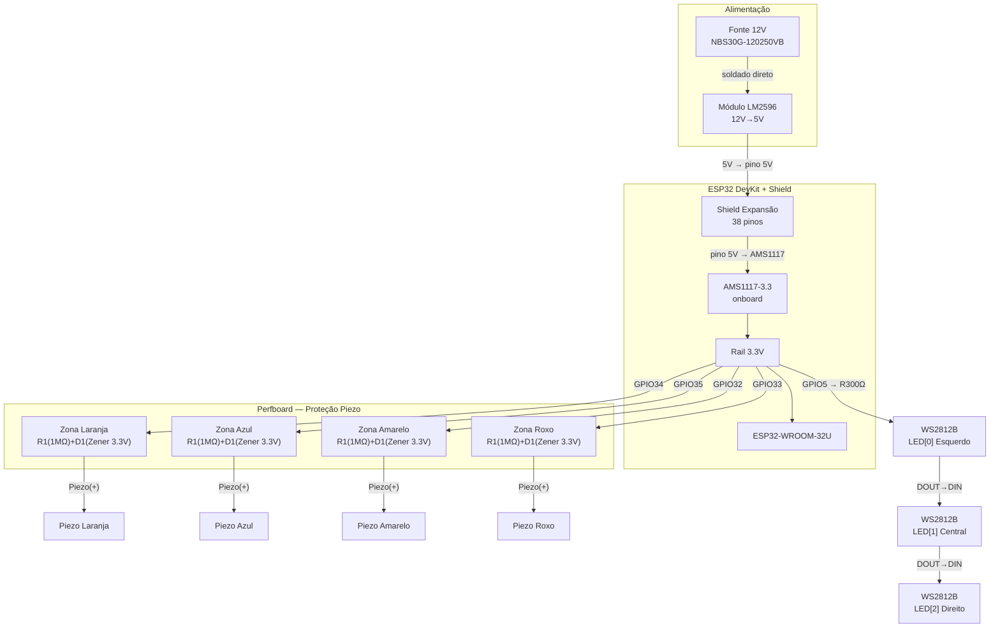

# 09_CONEXOES.md — Conexões e Mapeamento de Pinos

---

## 1. Identificação <a id="identificacao"></a>

| Campo | Valor |
|---|---|
| Documento | 09_conexoes.md |
| Versão | 0.2.2 |
| Status | APROVADO |
| Escopo | Conexões elétricas completas — alimentação, sensores, LEDs, shield |

---

## 2. Objetivo do Documento <a id="objetivo"></a>

Especificar todas as conexões elétricas do sistema em forma esquemática. Serve como fonte única de verdade para montagem física e cablagem. Os fios individuais são especificados em [VER: 10_cablagem.md#tabela-fios].

---

## 3. Visão Geral do Sistema <a id="visao-geral"></a>



**Nota sobre o AMS1117-3.3:** o nó representado no diagrama acima é o regulador linear integrado ao ESP32 DevKit (E01) — não é um componente externo. Não consta no BOM e não há etapa de instalação: o AMS1117 já está soldado na placa do DevKit. Ao encaixar o DevKitC V4 no shield e alimentar o pino **5V** com 5V, o rail 3.3V é produzido automaticamente. [VER: 05_alimentacao.md#cadeia-alimentacao]

---

## 4. Cadeia de Alimentação — Detalhe <a id="cadeia-alimentacao-ascii"></a>

```
Fonte 12V ──(soldado)──► LM2596 OUT+ ──► Barramento 5V (+)
                          LM2596 OUT− ──► Barramento 5V (−)

Barramento 5V (+) ──► Shield pino 5V ──► ESP32 DevKitC V4 pino 5V
                                      │
                                      ├──► AMS1117-3.3 (onboard)
                                      │         │
                                      │         └──► Rail 3.3V
                                      │                  │
                                      │    ┌─────────────┤
                                      │    │             │
                                      │  ESP32 chip    3× WS2812B VDD
                                      │
                                      └──► Decoupling: 10μF/16V + 100nF/50V

LM2596 Saída: 470μF/10V + 100nF/50V
Entrada 12V:  100μF/25V
WS2812B VDD:  10μF/16V + 100nF/50V (por LED) — [VER: 05_alimentacao.md#decoupling]
```

---

## 5. Mapeamento de Pinos do Shield <a id="mapeamento-shield"></a>

| Pino Shield | Sinal | Destino | Referência |
|---|---|---|---|
| 5V (rótulo no DevKitC V4) | 5V entrada | Barramento LM2596 saída | [VER: 05_alimentacao.md#conexao-fisica] |
| GND | GND | Barramento GND | — |
| GPIO 34 | ADC1 — Laranja | Perfboard saída Zona 1 | [VER: 01_arquitetura.md#mapeamento-gpios] |
| GPIO 35 | ADC1 — Azul | Perfboard saída Zona 2 | [VER: 01_arquitetura.md#mapeamento-gpios] |
| GPIO 32 | ADC1 — Amarelo | Perfboard saída Zona 3 | [VER: 01_arquitetura.md#mapeamento-gpios] |
| GPIO 33 | ADC1 — Roxo | Perfboard saída Zona 4 | [VER: 01_arquitetura.md#mapeamento-gpios] |
| GPIO 5 | Dados LED | R300Ω → LED[0] DIN | [VER: 01_arquitetura.md#mapeamento-gpios] |

---

## 6. Circuito de Proteção Piezo — Perfboard <a id="circuito-protecao-perfboard"></a>

4 instâncias idênticas em perfboard 5×7cm. Derivado de [VER: 02_sensor_impacto.md#esquema-protecao].

```
Por zona (repetir ×4):

  Piezo(+) ──────── R1 (1MΩ) ──────┬──── Para shield GPIO_N
                                     │
                                   [K]─── D1 Zener 3.3V ───[A]
                                     │
  Piezo(−) ────────────────────────┴──── GND comum perfboard
```

GND comum da perfboard → Shield GND.

---

## 7. Cadeia de LEDs <a id="cadeia-leds"></a>

```
Shield GPIO5 ──► R300Ω ──► LED[0] DIN
                            LED[0] DOUT ──► LED[1] DIN
                                            LED[1] DOUT ──► LED[2] DIN

Por LED (próximo ao VDD):
  VDD ──┬── 10μF/16V ── GND
        └── 100nF/50V ── GND
```

R300Ω em série na linha de dados: protege GPIO5 e atenua reflexões no cabo.

---

## 8. Critérios de Aceitação <a id="criterios-aceitacao"></a>

| # | Teste | Condição de aprovação |
|---|---|---|
| CA-09-01 | Continuidade alimentação | Pino 5V shield → saída AMS1117: 3.3V ± 5% sem ESP32 conectado |
| CA-09-02 | Isolamento 12V→5V | Sem curto entre entrada e saída LM2596 |
| CA-09-03 | Tensão GPIO em repouso | Todos os GPIOs de piezo leem 0V em repouso |
| CA-09-04 | Proteção Zener | GPIO não ultrapassa 3.3V com impacto forte |
| CA-09-05 | Cadeia LED | GPIO5 → LED[0] → LED[1] → LED[2]: todos respondem ao comando |
| CA-09-06 | Isolamento sinais ADC | Resistência entre GPIO34, GPIO35, GPIO32, GPIO33: ∞ — sem contato metálico entre os nós de sinal |

---

## Changelog

| Versão | Data | Seção | Mudança | Impacto em dependentes |
|---|---|---|---|---|
| 0.1.0 | 2026-06-26 | — | Criação — reescrita do zero com âncoras, _PADRAO v0.1.0 | 10, 11 |
| 0.2.0 | 2026-06-30 | #visao-geral | Adiciona nota: AMS1117-3.3 é regulador onboard do DevKit (E01), não componente externo; atualiza depende_de (02 v0.1.1, 03 v0.1.1, 05 v0.2.0, 08 v0.2.0) | 10, 11 [PATCH depende_de] |
| 0.2.1 | 2026-07-01 | #visao-geral | Corrige sintaxe Mermaid: labels de aresta com parênteses envolvidos em aspas (`|"Piezo(+)"|`) | 10, 11 [PATCH depende_de] |
| 0.2.2 | 2026-07-01 | depende_de, Rastreabilidade | Atualiza referências: 01 v0.1.0→v0.2.0, 02 v0.1.1→v0.1.2, 03 v0.1.1→v0.1.2, 05 v0.2.0→v0.2.1, 08 v0.2.0→v0.2.1 (bump MINOR retroativo de 01) | 10, 11 |
| 0.2.3 | 2026-07-01 | #visao-geral, #cadeia-alimentacao-ascii, #mapeamento-shield, #criterios-aceitacao | Substitui rótulo "VIN" por "pino 5V" / "5V" — DevKitC V4 rotula o pino de entrada como "5V"; atualiza depende_de: 01 v0.2.1, 02 v0.1.3, 03 v0.1.3, 05 v0.2.2, 08 v0.2.2 | 10, 11 |

---

## Rastreabilidade

| Tipo | Documento | Versão | Vínculo | Âncora relevante |
|---|---|---|---|---|
| Pai | _PADRAO.md | 0.1.0 | BLOQUEADOR | — |
| Pai | 00_conceito.md | 0.1.0 | BLOQUEADOR | #componentes-fisicos |
| Pai | 01_arquitetura.md | 0.2.1 | BLOQUEADOR | #hardware, #mapeamento-gpios |
| Pai | 02_sensor_impacto.md | 0.1.3 | BLOQUEADOR | #esquema-protecao, #mapeamento-gpios-sensor |
| Pai | 03_saida_visual.md | 0.1.3 | BLOQUEADOR | #mapeamento-led, #decoupling-led |
| Pai | 05_alimentacao.md | 0.2.2 | BLOQUEADOR | #cadeia-alimentacao, #decoupling, #conexao-fisica |
| Pai | 08_bom.md | 0.2.2 | BLOQUEADOR | #eletronicos-ativos, #passivos |
| Filho | 10_cablagem.md | — | OBRIGATÓRIO | #cadeia-alimentacao-ascii, #mapeamento-shield, #circuito-protecao-perfboard, #cadeia-leds |
| Filho | 11_montagem.md | — | OBRIGATÓRIO | todo este documento |
---

Licenca: GPL-3.0 — consulte `/LICENSE` na raiz do repositorio.
