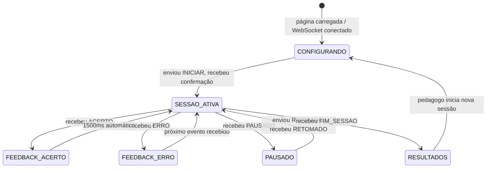

# 07_INTERFACE_PEDAGOGO.md — Interface do Pedagogo (MOD_WIFI)

---

## 1. Identificação <a id="identificacao"></a>

| Campo | Valor |
|---|---|
| Documento | 07_interface_pedagogo.md |
| Versão | 0.4.0 |
| Status | APROVADO |
| Módulo firmware | MOD_WIFI — [VER: 01_arquitetura.md#mod-wifi] |
| Stack | HTML + CSS + JS puro, sem framework — [VER: 01_arquitetura.md#stack-tecnologico] |

---

## 2. Objetivo do Documento <a id="objetivo"></a>

Especificar MOD_WIFI (firmware) e a interface HTML do pedagogo: Access Point, servidor HTTP, protocolo WebSocket, estados da interface no browser, feedback visual e sonoro, armazenamento localStorage e exportação de dados (CSV e PDF, com pré-visualização e confirmação). Derive de [VER: 00_conceito.md#interface-pedagogo], [VER: 00_conceito.md#feedback] e [VER: 00_conceito.md#gestao-dados]. As interfaces C++ entre MOD_WIFI e MOD_JOGO são definidas em [VER: 01_arquitetura.md#interface-jogo-wifi] e **não se repetem aqui**.

---

## 3. MOD_WIFI — Firmware ESP32 <a id="mod-wifi-firmware"></a>

### 3.1 Access Point <a id="access-point"></a>

| Parâmetro | Valor |
|---|---|
| Modo | WiFi Access Point (AP) — sem roteador externo |
| SSID | `BMI` (ajustar após definição do nome do projeto) |
| Senha | Sem senha — acesso direto pelo pedagogo |
| IP do ESP32 | `192.168.4.1` (padrão ESP32 AP) |
| Canal | 1 (padrão) |
| Operação offline | Total — [VER: 01_arquitetura.md#requisitos-nao-funcionais] RNF-04 |

### 3.2 Servidor HTTP <a id="servidor-http"></a>

Implementado com ESPAsyncWebServer — [VER: 01_arquitetura.md#stack-tecnologico].

| Rota | Método | Resposta |
|---|---|---|
| `/` | GET | Interface HTML completa (inline — arquivo único) |
| `/ws` | WebSocket | Canal de comunicação bidirecional com o browser |

A interface HTML é servida como arquivo único embutido no firmware (PROGMEM ou LittleFS). Nenhuma requisição de recursos externos é feita — operação offline-first.

### 3.3 WebSocket <a id="websocket"></a>

URL: `ws://192.168.4.1/ws`

- Full-duplex, mensagens JSON
- Latência máxima evento → tela: < 200ms — [VER: 01_arquitetura.md#requisitos-nao-funcionais] RNF-02
- Desconexão detectada por ping/pong padrão ESPAsyncWebSocket
- Ao detectar desconexão: chamar `pausarSessao()` — [VER: 01_arquitetura.md#interface-jogo-wifi]
- Ao reconectar: chamar `retomarSessao()` — [VER: 01_arquitetura.md#interface-jogo-wifi]
- Comportamento de desconexão/reconexão derivado de [VER: 00_conceito.md#desconexao]

---

## 4. Protocolo de Mensagens WebSocket <a id="protocolo-mensagens"></a>

Mapeamento JSON das interfaces C++ definidas em [VER: 01_arquitetura.md#interface-jogo-wifi]. Os nomes de campo JSON correspondem diretamente aos campos das structs `ConfigSessao` e `EventoResultado`.

### 4.1 Browser → ESP32 <a id="mensagens-browser-esp32"></a>

```json
// Iniciar sessão — mapeia ConfigSessao
{ "tipo": "INICIAR", "nome": "Ana", "n": 10,
  "modo": "UM_MARTELO", "mecanismo": "A_SHUFFLE", "janela_ms": 800 }

// Pausar sessão
{ "tipo": "PAUSAR" }

// Retomar sessão após pausa
{ "tipo": "RETOMAR" }

// Encerrar sessão antes do N configurado (M1) — [VER: 00_conceito.md#encerramento-antecipado]
{ "tipo": "ENCERRAR" }
```

Valores válidos para `modo`: `"UM_MARTELO"` | `"DOIS_MARTELOS"`
Valores válidos para `mecanismo`: `"A_SHUFFLE"` | `"B_PESO"`
`janela_ms`: inteiro, padrão 800, visível na UI apenas quando `modo == "DOIS_MARTELOS"` — [VER: 00_conceito.md#configuracao-pre-sessao]

### 4.2 ESP32 → Browser <a id="mensagens-esp32-browser"></a>

```json
// Acerto registrado — mapeia EventoResultado{ACERTO}
{ "tipo": "ACERTO", "acertos": 3, "total": 10, "duracao_ms": 15000 }

// Erro registrado — mapeia EventoResultado{ERRO}
{ "tipo": "ERRO", "acertos": 2, "total": 10, "duracao_ms": 8000 }

// Sessão concluída — mapeia EventoResultado{FIM_SESSAO}
{ "tipo": "FIM_SESSAO", "acertos": 10, "total": 10, "duracao_ms": 45000 }

// Confirmação de pausa
{ "tipo": "PAUSADO" }

// Confirmação de retomada
{ "tipo": "RETOMADO" }
```

---

## 5. Estados da Interface no Browser <a id="estados-interface"></a>



### 5.1 Tela de Configuração <a id="tela-configuracao"></a>

Campos derivados de [VER: 00_conceito.md#configuracao-pre-sessao]:

| Campo UI | Tipo | Validação | Padrão |
|---|---|---|---|
| Nome da criança | Texto | Obrigatório, não vazio | — |
| N interações | Número inteiro | ≥ 1 | — |
| Modo | Seleção: `1 Martelo` / `2 Martelos` | Obrigatório | `1 Martelo` |
| Mecanismo | Seleção: `A (uniforme)` / `B (variado)` | Obrigatório | `A` |
| Janela (ms) | Número inteiro | Visível **somente** se Modo = `2 Martelos` | 800 |

Ao submeter: validar campos, construir mensagem `INICIAR` e enviar via WebSocket.

### 5.2 Tela de Sessão Ativa <a id="tela-sessao-ativa"></a>

Exibe em tempo real, atualizado a cada `ACERTO` ou `ERRO` recebido:
- Progresso: `acertos / total` e taxa percentual
- Nome da criança (informativo)
- Botão PAUSAR → envia `{ "tipo": "PAUSAR" }`
- Botão ENCERRAR SESSÃO → confirmação obrigatória (ação destrutiva — descarta as interações restantes do N configurado); confirmado, envia `{ "tipo": "ENCERRAR" }` — [VER: 00_conceito.md#encerramento-antecipado]. A tela só muda ao receber `FIM_SESSAO`, tratado de forma idêntica à conclusão natural da sessão — ver [VER: #tela-resultados]

Sem exibição de cor, estímulo ou informação do jogo — a criança usa a mesa física.

### 5.3 Tela de Feedback <a id="tela-feedback"></a>

Derivado de [VER: 00_conceito.md#feedback-acerto] e [VER: 00_conceito.md#feedback-erro].

| Evento | Cor da tela | Duração | Som |
|---|---|---|---|
| `ACERTO` | Verde `#2ECC40` | 1500ms, depois retorna a SESSAO_ATIVA | [VER: #feedback-sonoro] |
| `ERRO` | Vermelho `#FF4136` | Até próximo evento recebido | [VER: #feedback-sonoro] |

Implementação: overlay CSS de tela cheia sobre a tela de sessão ativa. Nenhum texto ou ícone — só cor. Compatível com qualquer browser mobile moderno — [VER: 01_arquitetura.md#requisitos-nao-funcionais] RNF-05.

### 5.4 Tela de Resultados <a id="tela-resultados"></a>

Exibida ao receber `FIM_SESSAO`. Derivado de [VER: 00_conceito.md#feedback-fim-sessao].

Campos exibidos:
- Nome da criança
- Acertos / total de interações
- Taxa de acerto (%)
- Duração da sessão (minutos:segundos)
- Botão: **Exportar** → abre a pré-visualização de exportação [VER: #pre-visualizacao]; nenhum download é iniciado neste clique
- Botão: **Nova Sessão** → retorna a CONFIGURANDO e persiste registro em [VER: #armazenamento-dados]

Score **não é exibido à criança** — tela somente visível no dispositivo do pedagogo. Fundamentação em [VER: 00_conceito.md#feedback-fim-sessao].

---

## 6. Feedback Sonoro <a id="feedback-sonoro"></a>

Derivado de [VER: 00_conceito.md#feedback-acerto] e [VER: 00_conceito.md#feedback-erro]. Implementado via Web Audio API — sem arquivos externos, compatível com operação offline.

| Evento | Frequência | Duração | Envelope |
|---|---|---|---|
| Acerto | 440Hz → 880Hz (dois tons ascendentes) | 200ms cada | Attack 10ms, Release 50ms |
| Erro | 220Hz (tom único neutro) | 150ms | Attack 10ms, Release 50ms |

```js
// Exemplo de implementação (acerto)
const ctx = new AudioContext();
function tocarAcerto() {
  [440, 880].forEach((freq, i) => {
    const osc = ctx.createOscillator();
    const env = ctx.createGain();
    osc.frequency.value = freq;
    osc.connect(env); env.connect(ctx.destination);
    const t = ctx.currentTime + i * 0.22;
    env.gain.setValueAtTime(0, t);
    env.gain.linearRampToValueAtTime(0.4, t + 0.01);
    env.gain.linearRampToValueAtTime(0, t + 0.20);
    osc.start(t); osc.stop(t + 0.22);
  });
}
```

Caráter: positivo (acerto), não-punitivo e neutro (erro) — [VER: 00_conceito.md#feedback-erro].

---

## 7. Armazenamento de Dados <a id="armazenamento-dados"></a>

Derivado de [VER: 00_conceito.md#armazenamento] e estrutura de [VER: 04_logica_jogo.md#gestao-score].

**Tecnologia:** `localStorage` do browser — persistente no dispositivo do pedagogo. ESP32 não persiste dados — [VER: 00_conceito.md#responsabilidade-dados].

**Chave localStorage:** `"bmi_sessoes"` (atualizar com nome do projeto quando definido).

**Valor:** array JSON de registros. Cada registro criado ao confirmar **Nova Sessão** na tela de resultados:

```json
{
  "id": "1719369000000",
  "nome": "Ana",
  "timestamp_inicio": "2026-06-26T10:30:00.000Z",
  "modo": "UM_MARTELO",
  "mecanismo": "A_SHUFFLE",
  "n_configurado": 10,
  "acertos": 8,
  "erros": 3,
  "taxa_pct": 80.0,
  "duracao_s": 45.0
}
```

| Campo | Origem | Tipo |
|---|---|---|
| `id` | `Date.now()` ao iniciar sessão | string (ms epoch) |
| `nome` | Campo UI → `ConfigSessao.nome_crianca` | string |
| `timestamp_inicio` | `new Date().toISOString()` ao iniciar | string ISO 8601 |
| `modo` | Campo UI → `ConfigSessao.Modo` | `"UM_MARTELO"` \| `"DOIS_MARTELOS"` |
| `mecanismo` | Campo UI → `ConfigSessao.Mecanismo` | `"A_SHUFFLE"` \| `"B_PESO"` |
| `n_configurado` | Campo UI → `ConfigSessao.n_interacoes` | integer |
| `acertos` | `EventoResultado.acertos` no `FIM_SESSAO` | integer |
| `erros` | Contagem browser de eventos `ERRO` | integer |
| `taxa_pct` | `(acertos / n_configurado) * 100` | float, 1 casa decimal |
| `duracao_s` | `EventoResultado.duracao_ms / 1000` | float, 1 casa decimal |

**Sessão encerrada antecipadamente** ([VER: 00_conceito.md#encerramento-antecipado], botão ENCERRAR SESSÃO em [VER: #tela-sessao-ativa]): usa exatamente esta mesma estrutura, sem campo adicional. `acertos < n_configurado` identifica o registro sem ambiguidade — uma sessão concluída naturalmente só emite `FIM_SESSAO` com `acertos == n_configurado` ([VER: 04_logica_jogo.md#transicoes]).

---

## 8. Exportação <a id="exportacao-csv"></a>

O formato CSV deriva de [VER: 00_conceito.md#exportacao]. A pré-visualização com confirmação ([VER: #pre-visualizacao]) e o formato PDF ([VER: #exportacao-pdf]) originam-se da validação de sistema (ETAPA 8 — melhorias M2/M3 do TODO.md), mesmo trâmite do defeito D1.

Fluxo de exportação: botão **Exportar** na tela de resultados → pré-visualização dos dados → escolha do formato (CSV ou PDF) → confirmação → download. Exporta **todos** os registros em `localStorage`, em qualquer formato.

**Cabeçalho e colunas** (na mesma ordem dos campos de [VER: #armazenamento-dados]):

```
id,nome,timestamp_inicio,modo,mecanismo,n_configurado,acertos,erros,taxa_pct,duracao_s
```

### 8.1 Requisitos do arquivo exportado <a id="requisitos-csv"></a>

| # | Requisito | Valor | Justificativa |
|---|---|---|---|
| CSV-01 | Codificação | UTF-8 com BOM (U+FEFF prefixado ao conteúdo) | Nomes pt-BR contêm acentos; planilhas Windows assumem ANSI na ausência de BOM e corrompem a acentuação |
| CSV-02 | Escaping de campo | RFC 4180 §2: campo contendo vírgula, aspas ou quebra de linha é envolvido em aspas duplas; aspas internas duplicadas | Nome de criança pode conter vírgula/aspas — sem escaping as colunas deslocam (condição ideal proibida) |
| CSV-03 | MIME type | `text/csv` com `charset=utf-8` explícito | Sem charset o browser/planilha decide a codificação por heurística |
| CSV-04 | Mecanismo de download | `data:` URI (RFC 2397) em âncora com atributo `download`, anexada ao DOM antes de `click()` e removida após | Ver [VER: #mecanismo-download] |

### 8.2 Mecanismo de download <a id="mecanismo-download"></a>

```
DECISAO: download via data: URI (RFC 2397) com conteúdo percent-encoded,
  atributo download em âncora anexada ao document.body antes do click()
  e removida em seguida. Sem object URLs, sem revogação.
JUSTIFICATIVA: a implementação anterior (blob + URL.createObjectURL +
  revokeObjectURL síncrono + âncora fora do DOM) falhava silenciosamente:
  (1) revogação síncrona invalida a URL antes do fetch assíncrono do
  download; (2) click() sintético em elemento fora do DOM é ignorado por
  Firefox e browsers WebView; (3) o DownloadManager de WebViews Android
  não resolve URLs blob: (contexto fora da página). data: URI carrega o
  conteúdo na própria URL — resolvível por qualquer gerenciador de
  download. Volume de dados trivial (~100 bytes/registro) descarta o
  único custo do data: URI (inflação do percent-encoding).
FASE V-MODEL: Fase 8 — correção derivada da validação de sistema (D1).
VALIDACAO: CA-07-09 — [VER: #criterios-aceitacao].
ANALISE DE FALHA: browser sem suporte ao atributo download (fora da
  matriz RNF-05) não inicia o download; localStorage permanece intacto —
  sem perda de dados; re-exportar em browser suportado recupera tudo.
ALTERNATIVA: blob + revogação adiada — descartada: continua falhando em
  WebViews (blob: irresolvível pelo DownloadManager). Download servido
  pelo ESP32 — descartada: exigiria enviar dados de sessão ao ESP32,
  violando 00_conceito.md#responsabilidade-dados.
```

**Constatação de origem (D1, validação 2026-07-03):** clicar em "Exportar CSV" não produzia nenhum efeito em browser WebView Android (DuckDuckGo). As três falhas listadas na JUSTIFICATIVA existiam simultaneamente na implementação anterior.

**Implementação de referência** (nomes de constantes conforme WEB_STANDARD.md):

```js
function csvEscapar(campo) {
  const s = String(campo);
  // RFC 4180 §2: envolver em aspas se contiver vírgula, aspas ou quebra de linha
  return /[",\r\n]/.test(s) ? '"' + s.replace(/"/g, '""') + '"' : s;
}

function exportarCSV() {
  const sessoes = carregarSessoes();
  const linhas = sessoes.map(s =>
    [s.id, s.nome, s.timestamp_inicio, s.modo, s.mecanismo,
     s.n_configurado, s.acertos, s.erros, s.taxa_pct, s.duracao_s]
      .map(csvEscapar).join(',')
  );
  const csv = CSV_BOM + [CSV_CABECALHO].concat(linhas).join('\n');
  const a = document.createElement('a');
  a.href     = CSV_DATA_URI_PREFIX + encodeURIComponent(csv);
  a.download = CSV_NOME_ARQUIVO;
  document.body.appendChild(a);  // click() fora do DOM é ignorado por Firefox/WebView
  a.click();
  document.body.removeChild(a);
}
```

`CSV_DATA_URI_PREFIX` é composto de `data:` + tipo MIME + `;charset=` + charset + `,` — valores derivados de `spec/interface/interface.json#exportacao_csv` (`tipo_mime`, `charset`). `CSV_BOM` deriva de `spec/interface/interface.json#exportacao_csv.bom` (valor `"\uFEFF"` — requisito CSV-01). Nenhum destes valores é hardcoded no firmware.

A exportação PDF usa o **mesmo mecanismo** (âncora com `download` anexada ao DOM, `data:` URI), com uma diferença: o conteúdo é binário e vai codificado em **base64** (`data:application/pdf;base64,`), o encoding canônico do RFC 2397 para dados binários — requisito PDF-06 em [VER: #exportacao-pdf].

### 8.3 Pré-visualização e confirmação <a id="pre-visualizacao"></a>

Derivado da melhoria M2 (validação ETAPA 8): o pedagogo confere os dados antes de baixar. Nenhum download inicia sem confirmação explícita.

| # | Requisito | Valor | Justificativa |
|---|---|---|---|
| PRE-01 | Gatilho | Botão **Exportar** na tela de resultados abre a pré-visualização; nenhum download é iniciado neste momento | M2 — conferência antes do download |
| PRE-02 | Conteúdo | Tabela HTML com as mesmas 10 colunas de [VER: #armazenamento-dados], na mesma ordem, com **todos** os registros do `localStorage` — exatamente os dados que serão exportados | M2 — a prévia e o arquivo não podem divergir |
| PRE-03 | Escolha de formato | Seletor com exatamente dois formatos: `CSV` e `PDF`; padrão `CSV` | M3 — CSV para planilha, PDF para leitura |
| PRE-04 | Confirmação | Botão **Baixar** inicia o download no formato selecionado e fecha a pré-visualização; botão **Cancelar** fecha sem qualquer download | M2 — confirmação subsequente |
| PRE-05 | Sem dados | Com `localStorage` vazio: a pré-visualização exibe aviso de ausência de registros e o botão **Baixar** fica desabilitado | Condição não-ideal obrigatória — exportar vazio não tem efeito útil |

A pré-visualização é um overlay sobre a tela de resultados — não é um novo estado da máquina de [VER: #estados-interface]: o estado permanece `RESULTADOS` enquanto o overlay está visível.

### 8.4 Exportação PDF <a id="exportacao-pdf"></a>

Derivado da melhoria M3 (validação ETAPA 8): relatório legível para leitura humana, complementar ao CSV (que é para planilha).

```
DECISAO: gerar o PDF no browser em JS puro — PDF 1.4, fontes base-14
  (Helvetica-Bold para título, Helvetica para metadados, Courier para a
  tabela), texto em WinAnsiEncoding, página A4 paisagem com paginação —
  baixado por data: URI base64 em âncora anexada ao DOM.
JUSTIFICATIVA: RNF-04 (offline total) e RNF-07 (sem framework) proíbem
  biblioteca externa (jsPDF/pdfmake). Fontes base-14 dispensam embutir
  fonte (ISO 32000-1 §9.6.2.2) e WinAnsiEncoding cobre a acentuação
  pt-BR (ISO 32000-1 Annex D.2). Courier tem métrica fixa (600/1000 da
  unidade da fonte), tornando o layout da tabela aritmético e
  verificável sem medição de glifos. O mecanismo de download é o mesmo
  já validado para o CSV ([VER: #mecanismo-download]), com base64 por
  o PDF ser binário.
FASE V-MODEL: Fase 8 — melhoria derivada da validação de sistema (M3).
VALIDACAO: CA-07-13 — [VER: #criterios-aceitacao]; pré-validação da
  estrutura do arquivo (cabeçalho %PDF, offsets da xref byte-exatos,
  %%EOF, conteúdo das linhas) executando o JS embutido em Node.
ANALISE DE FALHA: caractere fora do WinAnsi (ex: emoji no nome) é
  substituído por '?' apenas no PDF — o dado original permanece íntegro
  no localStorage e no CSV (UTF-8). Exceção JS durante a geração não
  inicia download e não altera o localStorage.
ALTERNATIVA: window.print() + "salvar como PDF" — descartada: não
  produz download direto e depende do diálogo de impressão do browser,
  inexistente/inconsistente em WebViews Android (mesma classe de falha
  do D1). Biblioteca externa — descartada: viola RNF-04/RNF-07.
  Relatório HTML baixável — descartada: não atende ao requisito de PDF.
```

**Requisitos do arquivo PDF:**

| # | Requisito | Valor | Justificativa |
|---|---|---|---|
| PDF-01 | Formato | PDF 1.4, fontes base-14 (`Helvetica-Bold`, `Helvetica`, `Courier`), sem fontes embutidas | Leitor universal; zero dependência externa (RNF-04/RNF-07) |
| PDF-02 | Codificação de texto | `WinAnsiEncoding` (ISO 32000-1 Annex D.2); caractere sem representação WinAnsi substituído por `?` | Cobre a acentuação pt-BR sem embutir fonte |
| PDF-03 | Conteúdo | Título do relatório; linha de metadados com data/hora de geração (formato `dd/mm/aaaa hh:mm`, relógio do dispositivo do pedagogo), total de sessões e `Página N de M`; tabela com **todas** as sessões e **todas** as 10 colunas de [VER: #armazenamento-dados] | M3 — indicador da geração com data/hora e todos os dados de sessão |
| PDF-04 | Layout | A4 paisagem `842 × 595 pt` (ISO 216 em pontos, arredondado), margem `40 pt`, título `16 pt`, metadados `10 pt`, tabela Courier `8 pt` (passo horizontal `4.8 pt = 0.6 × 8`), altura de linha `12 pt`, `35` linhas de dados por página, paginação automática | Tabela de 10 colunas não cabe em retrato; valores fixos tornam o layout determinístico |
| PDF-05 | Escaping e truncamento | `\`, `(` e `)` escapados com `\` (ISO 32000-1 §7.3.4.2); campo mais largo que a coluna truncado em `largura − 2` caracteres + `…` | String PDF válida; largura de coluna nunca estoura |
| PDF-06 | Mecanismo de download | [VER: #mecanismo-download] com conteúdo em base64: `data:application/pdf;base64,` | PDF é binário — percent-encoding de texto corromperia os bytes |

**Derivação das 35 linhas de dados por página:** o cabeçalho ocupa do topo `margem (40) + título (16) + espaço pós-título (20) + metadados (10) + espaço pós-metadados (24) = 110 pt`; da área restante `595 − 110 − 40 (margem inferior) = 445 pt`, cabem `floor(445 / 12) = 37` linhas, das quais 2 são o cabeçalho da tabela (títulos das colunas + linha separadora) → **35 linhas de dados**.

**Colunas da tabela** (largura em caracteres Courier; soma 139 ≤ `floor((842 − 2×40) / 4.8) = 158`):

| Campo | Título da coluna | Largura (chars) |
|---|---|---|
| `id` | `Id` | 14 |
| `nome` | `Nome` | 40 |
| `timestamp_inicio` | `Início` | 25 |
| `modo` | `Modo` | 14 |
| `mecanismo` | `Mecanismo` | 10 |
| `n_configurado` | `N` | 4 |
| `acertos` | `Acertos` | 8 |
| `erros` | `Erros` | 6 |
| `taxa_pct` | `Taxa %` | 8 |
| `duracao_s` | `Dur. s` | 10 |

Todos os valores acima (nome de arquivo, MIME, versão PDF, fontes, dimensões, espaçamentos, colunas) são campos de `spec/interface/interface.json#exportacao_pdf` — nenhum é hardcoded no firmware.

---

## 9. Critérios de Aceitação <a id="criterios-aceitacao"></a>

| # | Teste | Condição de aprovação |
|---|---|---|
| CA-07-01 | Hotspot visível | `BMI` aparece na lista WiFi do dispositivo pedagogo em < 5s após boot |
| CA-07-02 | Carregamento da interface | Browser abre `192.168.4.1`, tela de configuração carrega em < 3s |
| CA-07-03 | Formulário — validação | Submeter com nome vazio: bloqueado com mensagem; submeter completo: sessão inicia |
| CA-07-04 | Janela visível somente Modo 2 | Selecionar Modo 1: campo janela oculto; Modo 2: campo janela visível |
| CA-07-05 | Feedback acerto | Tela verde + som ascendente em < 200ms após impacto correto; desaparece em 1500ms |
| CA-07-06 | Feedback erro | Tela vermelha + som neutro em < 200ms após impacto errado; mantida até próximo evento |
| CA-07-07 | Tela de resultados | Ao receber FIM_SESSAO: exibe nome, acertos/total, taxa%, duração |
| CA-07-08 | Persistência localStorage | Confirmar Nova Sessão: registro aparece no localStorage com todos os campos |
| CA-07-09 | Exportação CSV | Selecionar `CSV` na pré-visualização e confirmar com **Baixar**: download com cabeçalho correto e dados de todas as sessões armazenadas; campo contendo vírgula/aspas/quebra preservado em coluna única (RFC 4180 — [VER: #requisitos-csv]); acentuação correta ao abrir em planilha (UTF-8 BOM) |
| CA-07-10 | Desconexão e retomada | WiFi pedagogo desligado: ESP32 pausa; reconectar: interface retoma sessão do ponto de pausa |
| CA-07-11 | Offline total | Interface funciona sem acesso à internet em todas as etapas |
| CA-07-12 | Pré-visualização e confirmação | Com ≥ 2 registros: clicar **Exportar** exibe tabela com todos os registros e as 10 colunas idênticos ao localStorage, sem iniciar download; **Cancelar** fecha sem download; com localStorage vazio: aviso exibido e **Baixar** desabilitado ([VER: #pre-visualizacao]) |
| CA-07-13 | Exportação PDF | Selecionar `PDF` na pré-visualização e confirmar: download de `bmi_sessoes.pdf` que abre sem erro em leitor de PDF; contém título, data/hora de geração, `Página N de M` e tabela com todas as sessões e todas as colunas; acentos corretos; com > 35 registros: segunda página com numeração correta ([VER: #exportacao-pdf]) |
| CA-07-14 | Encerramento antecipado | Na tela de sessão ativa: clicar ENCERRAR SESSÃO exibe confirmação; confirmado, sessão encerra com os acertos parciais corretos, tela de Resultados exibida, e Nova Sessão retorna à Configuração — sem recarregar a página nem reiniciar o ESP32 ([VER: 00_conceito.md#encerramento-antecipado]) |

---

## Changelog

| Versão | Data | Seção | Mudança | Impacto em dependentes |
|---|---|---|---|---|
| 0.1.0 | 2026-06-26 | — | Criação — derivada de 00_conceito v0.1.0 e 01_arquitetura v0.1.0 com âncoras e _PADRAO v0.1.0 | — |
| 0.1.1 | 2026-07-01 | depende_de, Rastreabilidade | Atualiza referências: 01_arquitetura.md v0.1.0→v0.2.0 (bump MINOR retroativo), 04_logica_jogo.md v0.1.0→v0.1.1 | — |
| 0.1.2 | 2026-07-01 | depende_de, Rastreabilidade | Atualiza referências: 01_arquitetura.md v0.2.0→v0.2.1 (especifica DevKitC V4), 04_logica_jogo.md v0.1.1→v0.1.2 | — |
| 0.2.0 | 2026-07-03 | #exportacao-csv, #criterios-aceitacao, #identificacao | Re-especifica exportação CSV a partir do defeito D1 (validação ETAPA 8): mecanismo `data:` URI + âncora anexada ao DOM substitui blob + revokeObjectURL síncrono (falha silenciosa em Firefox/WebView); novos requisitos CSV-01..04 (UTF-8 BOM, escaping RFC 4180, charset explícito); CA-07-09 estendido; corrige versão desatualizada na tabela de Identificação (0.1.1) | WEB_STANDARD.md, spec/interface/interface.json, spec/interface/interface.schema.json, firmware/src/interface/interface.cpp |
| 0.3.0 | 2026-07-03 | #exportacao-csv (§8 reestruturada), #pre-visualizacao, #exportacao-pdf, #tela-resultados, #criterios-aceitacao, #objetivo, #identificacao | Melhorias M2/M3 (validação ETAPA 8): pré-visualização com confirmação obrigatória antes de qualquer download (PRE-01..05); escolha de formato CSV/PDF; exportação PDF gerada em JS puro — PDF 1.4, fontes base-14, WinAnsiEncoding, A4 paisagem, paginação (PDF-01..06, DECISAO formal); botão da tela de resultados passa de "Exportar CSV" para "Exportar" (abre prévia); CA-07-09 ajustado ao novo fluxo; CA-07-12 e CA-07-13 novos | WEB_STANDARD.md, spec/interface/interface.json, spec/interface/interface.schema.json, firmware/src/interface/interface.cpp |
| 0.3.1 | 2026-07-03 | depende_de, Rastreabilidade | Cascata do conceito v0.2.0 (exportação CSV+PDF com pré-visualização, M2/M3 validados): atualiza referências — 00_conceito.md v0.1.0→v0.2.0, 01_arquitetura.md v0.2.1→v0.3.0 | — |
| 0.3.2 | 2026-07-03 | impacta, depende_de, Rastreabilidade | Registra 12_manual_pedagogo.md (manual de uso do pedagogo — melhoria M4 da validação ETAPA 8) como dependente OBRIGATÓRIO: o manual descreve as telas e fluxos aqui especificados; cascata do registro em 00 — atualiza referências 00_conceito.md v0.2.0→v0.2.1, 01_arquitetura.md v0.3.0→v0.3.1 | 12_manual_pedagogo.md (novo) |
| 0.4.0 | 2026-07-04 | #mensagens-browser-esp32, #tela-sessao-ativa, #armazenamento-dados, #criterios-aceitacao, depende_de | Melhoria M1 (TODO.md), validada manualmente no código antes da cascata: nova mensagem `ENCERRAR` (browser→ESP32) tratada só com sessão ativa; botão ENCERRAR SESSÃO na tela de sessão ativa, com confirmação obrigatória; resultado tratado pelo mesmo caminho `FIM_SESSAO` já existente (acertos parciais, sem estrutura de dado nova); novo CA-07-14 | spec/interface/interface.json, spec/interface/interface.schema.json, firmware/src/interface/interface.cpp, 12_manual_pedagogo.md |
| 0.4.1 | 2026-07-13 | depende_de, Rastreabilidade | Cascata mecânica do conceito v0.4.0 (correção de honestidade das referências científicas — sem impacto em interface/WebSocket/telas): atualiza referências — 00_conceito.md v0.3.0→v0.4.0, 01_arquitetura.md v0.4.0→v0.4.1, 04_logica_jogo.md v0.1.4→v0.2.1 | 12_manual_pedagogo.md |
| 0.4.2 | 2026-07-16 | depende_de, Rastreabilidade | Cascata mecânica do conceito v0.5.0 (§6.3 martelos — bater com a mão diretamente na zona também é detectado, martelo é opcional — sem impacto em interface/WebSocket/telas: campo `modo` continua `UM_MARTELO`/`DOIS_MARTELOS`, nomes fixos): atualiza referências — 00_conceito.md v0.4.0→v0.5.0, 01_arquitetura.md v0.4.1→v0.4.2, 04_logica_jogo.md v0.2.1→v0.2.2 | 12_manual_pedagogo.md |

---

## Rastreabilidade

| Tipo | Documento | Versão | Vínculo | Âncora relevante |
|---|---|---|---|---|
| Pai | _PADRAO.md | 0.1.0 | BLOQUEADOR | — |
| Pai | 00_conceito.md | 0.5.0 | BLOQUEADOR | #conectividade, #configuracao-pre-sessao, #desconexao, #encerramento-antecipado, #feedback-acerto, #feedback-erro, #feedback-fim-sessao, #armazenamento, #exportacao, #responsabilidade-dados |
| Pai | 01_arquitetura.md | 0.4.2 | BLOQUEADOR | #mod-wifi, #interface-jogo-wifi, #stack-tecnologico, #requisitos-nao-funcionais |
| Pai | 04_logica_jogo.md | 0.2.2 | CONDICIONAL: #gestao-score | #gestao-score |
| Filho | 12_manual_pedagogo.md | — | OBRIGATÓRIO | #access-point, #estados-interface, #tela-configuracao, #tela-resultados, #pre-visualizacao, #exportacao-csv |
---

Licenca: GPL-3.0 — consulte `/LICENSE` na raiz do repositorio.
