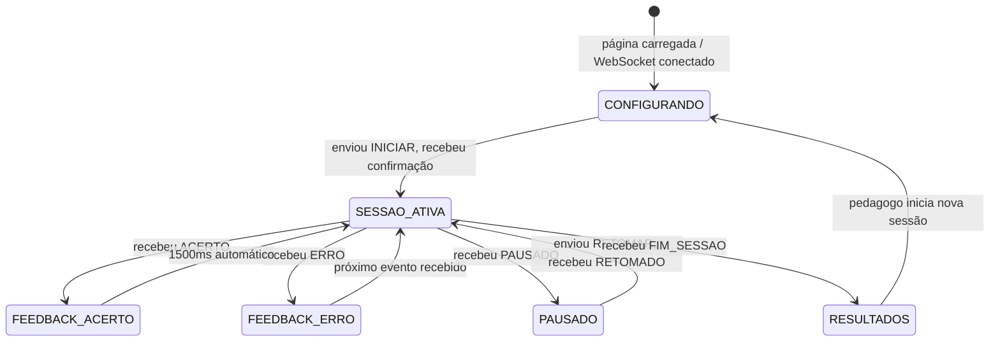

# 07_INTERFACE_PEDAGOGO.md — Interface do Pedagogo (MOD_WIFI)

---

## 1. Identificação <a id="identificacao"></a>

| Campo | Valor |
|---|---|
| Documento | 07_interface_pedagogo.md |
| Versão | 0.1.0 |
| Status | APROVADO |
| Módulo firmware | MOD_WIFI — [VER: 01_arquitetura.md#mod-wifi] |
| Stack | HTML + CSS + JS puro, sem framework — [VER: 01_arquitetura.md#stack-tecnologico] |

---

## 2. Objetivo do Documento <a id="objetivo"></a>

Especificar MOD_WIFI (firmware) e a interface HTML do pedagogo: Access Point, servidor HTTP, protocolo WebSocket, estados da interface no browser, feedback visual e sonoro, armazenamento localStorage e exportação CSV. Derive de [VER: 00_conceito.md#interface-pedagogo], [VER: 00_conceito.md#feedback] e [VER: 00_conceito.md#gestao-dados]. As interfaces C++ entre MOD_WIFI e MOD_JOGO são definidas em [VER: 01_arquitetura.md#interface-jogo-wifi] e **não se repetem aqui**.

---

## 3. MOD_WIFI — Firmware ESP32 <a id="mod-wifi-firmware"></a>

### 3.1 Access Point <a id="access-point"></a>

| Parâmetro | Valor |
|---|---|
| Modo | WiFi Access Point (AP) — sem roteador externo |
| SSID | `BMI` (ajustar após definição do nome do projeto) |
| Senha | Sem senha — acesso direto pelo pedagogo |
| IP do ESP32 | `192.168.4.1` (padrão ESP32 AP) |
| Canal | 1 (padrão) |
| Operação offline | Total — [VER: 01_arquitetura.md#requisitos-nao-funcionais] RNF-04 |

### 3.2 Servidor HTTP <a id="servidor-http"></a>

Implementado com ESPAsyncWebServer — [VER: 01_arquitetura.md#stack-tecnologico].

| Rota | Método | Resposta |
|---|---|---|
| `/` | GET | Interface HTML completa (inline — arquivo único) |
| `/ws` | WebSocket | Canal de comunicação bidirecional com o browser |

A interface HTML é servida como arquivo único embutido no firmware (PROGMEM ou LittleFS). Nenhuma requisição de recursos externos é feita — operação offline-first.

### 3.3 WebSocket <a id="websocket"></a>

URL: `ws://192.168.4.1/ws`

- Full-duplex, mensagens JSON
- Latência máxima evento → tela: < 200ms — [VER: 01_arquitetura.md#requisitos-nao-funcionais] RNF-02
- Desconexão detectada por ping/pong padrão ESPAsyncWebSocket
- Ao detectar desconexão: chamar `pausarSessao()` — [VER: 01_arquitetura.md#interface-jogo-wifi]
- Ao reconectar: chamar `retomarSessao()` — [VER: 01_arquitetura.md#interface-jogo-wifi]
- Comportamento de desconexão/reconexão derivado de [VER: 00_conceito.md#desconexao]

---

## 4. Protocolo de Mensagens WebSocket <a id="protocolo-mensagens"></a>

Mapeamento JSON das interfaces C++ definidas em [VER: 01_arquitetura.md#interface-jogo-wifi]. Os nomes de campo JSON correspondem diretamente aos campos das structs `ConfigSessao` e `EventoResultado`.

### 4.1 Browser → ESP32 <a id="mensagens-browser-esp32"></a>

```json
// Iniciar sessão — mapeia ConfigSessao
{ "tipo": "INICIAR", "nome": "Ana", "n": 10,
  "modo": "UM_MARTELO", "mecanismo": "A_SHUFFLE", "janela_ms": 800 }

// Pausar sessão
{ "tipo": "PAUSAR" }

// Retomar sessão após pausa
{ "tipo": "RETOMAR" }
```

Valores válidos para `modo`: `"UM_MARTELO"` | `"DOIS_MARTELOS"`
Valores válidos para `mecanismo`: `"A_SHUFFLE"` | `"B_PESO"`
`janela_ms`: inteiro, padrão 800, visível na UI apenas quando `modo == "DOIS_MARTELOS"` — [VER: 00_conceito.md#configuracao-pre-sessao]

### 4.2 ESP32 → Browser <a id="mensagens-esp32-browser"></a>

```json
// Acerto registrado — mapeia EventoResultado{ACERTO}
{ "tipo": "ACERTO", "acertos": 3, "total": 10, "duracao_ms": 15000 }

// Erro registrado — mapeia EventoResultado{ERRO}
{ "tipo": "ERRO", "acertos": 2, "total": 10, "duracao_ms": 8000 }

// Sessão concluída — mapeia EventoResultado{FIM_SESSAO}
{ "tipo": "FIM_SESSAO", "acertos": 10, "total": 10, "duracao_ms": 45000 }

// Confirmação de pausa
{ "tipo": "PAUSADO" }

// Confirmação de retomada
{ "tipo": "RETOMADO" }
```

---

## 5. Estados da Interface no Browser <a id="estados-interface"></a>



### 5.1 Tela de Configuração <a id="tela-configuracao"></a>

Campos derivados de [VER: 00_conceito.md#configuracao-pre-sessao]:

| Campo UI | Tipo | Validação | Padrão |
|---|---|---|---|
| Nome da criança | Texto | Obrigatório, não vazio | — |
| N interações | Número inteiro | ≥ 1 | — |
| Modo | Seleção: `1 Martelo` / `2 Martelos` | Obrigatório | `1 Martelo` |
| Mecanismo | Seleção: `A (uniforme)` / `B (variado)` | Obrigatório | `A` |
| Janela (ms) | Número inteiro | Visível **somente** se Modo = `2 Martelos` | 800 |

Ao submeter: validar campos, construir mensagem `INICIAR` e enviar via WebSocket.

### 5.2 Tela de Sessão Ativa <a id="tela-sessao-ativa"></a>

Exibe em tempo real, atualizado a cada `ACERTO` ou `ERRO` recebido:
- Progresso: `acertos / total` e taxa percentual
- Nome da criança (informativo)
- Botão PAUSAR → envia `{ "tipo": "PAUSAR" }`

Sem exibição de cor, estímulo ou informação do jogo — a criança usa a mesa física.

### 5.3 Tela de Feedback <a id="tela-feedback"></a>

Derivado de [VER: 00_conceito.md#feedback-acerto] e [VER: 00_conceito.md#feedback-erro].

| Evento | Cor da tela | Duração | Som |
|---|---|---|---|
| `ACERTO` | Verde `#2ECC40` | 1500ms, depois retorna a SESSAO_ATIVA | [VER: #feedback-sonoro] |
| `ERRO` | Vermelho `#FF4136` | Até próximo evento recebido | [VER: #feedback-sonoro] |

Implementação: overlay CSS de tela cheia sobre a tela de sessão ativa. Nenhum texto ou ícone — só cor. Compatível com qualquer browser mobile moderno — [VER: 01_arquitetura.md#requisitos-nao-funcionais] RNF-05.

### 5.4 Tela de Resultados <a id="tela-resultados"></a>

Exibida ao receber `FIM_SESSAO`. Derivado de [VER: 00_conceito.md#feedback-fim-sessao].

Campos exibidos:
- Nome da criança
- Acertos / total de interações
- Taxa de acerto (%)
- Duração da sessão (minutos:segundos)
- Botão: **Exportar CSV** → aciona [VER: #exportacao-csv]
- Botão: **Nova Sessão** → retorna a CONFIGURANDO e persiste registro em [VER: #armazenamento-dados]

Score **não é exibido à criança** — tela somente visível no dispositivo do pedagogo. Fundamentação em [VER: 00_conceito.md#feedback-fim-sessao].

---

## 6. Feedback Sonoro <a id="feedback-sonoro"></a>

Derivado de [VER: 00_conceito.md#feedback-acerto] e [VER: 00_conceito.md#feedback-erro]. Implementado via Web Audio API — sem arquivos externos, compatível com operação offline.

| Evento | Frequência | Duração | Envelope |
|---|---|---|---|
| Acerto | 440Hz → 880Hz (dois tons ascendentes) | 200ms cada | Attack 10ms, Release 50ms |
| Erro | 220Hz (tom único neutro) | 150ms | Attack 10ms, Release 50ms |

```js
// Exemplo de implementação (acerto)
const ctx = new AudioContext();
function tocarAcerto() {
  [440, 880].forEach((freq, i) => {
    const osc = ctx.createOscillator();
    const env = ctx.createGain();
    osc.frequency.value = freq;
    osc.connect(env); env.connect(ctx.destination);
    const t = ctx.currentTime + i * 0.22;
    env.gain.setValueAtTime(0, t);
    env.gain.linearRampToValueAtTime(0.4, t + 0.01);
    env.gain.linearRampToValueAtTime(0, t + 0.20);
    osc.start(t); osc.stop(t + 0.22);
  });
}
```

Caráter: positivo (acerto), não-punitivo e neutro (erro) — [VER: 00_conceito.md#feedback-erro].

---

## 7. Armazenamento de Dados <a id="armazenamento-dados"></a>

Derivado de [VER: 00_conceito.md#armazenamento] e estrutura de [VER: 04_logica_jogo.md#gestao-score].

**Tecnologia:** `localStorage` do browser — persistente no dispositivo do pedagogo. ESP32 não persiste dados — [VER: 00_conceito.md#responsabilidade-dados].

**Chave localStorage:** `"bmi_sessoes"` (atualizar com nome do projeto quando definido).

**Valor:** array JSON de registros. Cada registro criado ao confirmar **Nova Sessão** na tela de resultados:

```json
{
  "id": "1719369000000",
  "nome": "Ana",
  "timestamp_inicio": "2026-06-26T10:30:00.000Z",
  "modo": "UM_MARTELO",
  "mecanismo": "A_SHUFFLE",
  "n_configurado": 10,
  "acertos": 8,
  "erros": 3,
  "taxa_pct": 80.0,
  "duracao_s": 45.0
}
```

| Campo | Origem | Tipo |
|---|---|---|
| `id` | `Date.now()` ao iniciar sessão | string (ms epoch) |
| `nome` | Campo UI → `ConfigSessao.nome_crianca` | string |
| `timestamp_inicio` | `new Date().toISOString()` ao iniciar | string ISO 8601 |
| `modo` | Campo UI → `ConfigSessao.Modo` | `"UM_MARTELO"` \| `"DOIS_MARTELOS"` |
| `mecanismo` | Campo UI → `ConfigSessao.Mecanismo` | `"A_SHUFFLE"` \| `"B_PESO"` |
| `n_configurado` | Campo UI → `ConfigSessao.n_interacoes` | integer |
| `acertos` | `EventoResultado.acertos` no `FIM_SESSAO` | integer |
| `erros` | Contagem browser de eventos `ERRO` | integer |
| `taxa_pct` | `(acertos / n_configurado) * 100` | float, 1 casa decimal |
| `duracao_s` | `EventoResultado.duracao_ms / 1000` | float, 1 casa decimal |

---

## 8. Exportação CSV <a id="exportacao-csv"></a>

Derivado de [VER: 00_conceito.md#exportacao]. Acionado manualmente pelo pedagogo na tela de resultados ou em tela de histórico. Exporta **todos** os registros em `localStorage`.

**Cabeçalho e colunas** (na mesma ordem dos campos de [VER: #armazenamento-dados]):

```
id,nome,timestamp_inicio,modo,mecanismo,n_configurado,acertos,erros,taxa_pct,duracao_s
```

**Implementação:**
```js
function exportarCSV() {
  const sessoes = JSON.parse(localStorage.getItem('bmi_sessoes') || '[]');
  const header = 'id,nome,timestamp_inicio,modo,mecanismo,n_configurado,acertos,erros,taxa_pct,duracao_s';
  const linhas = sessoes.map(s =>
    [s.id, s.nome, s.timestamp_inicio, s.modo, s.mecanismo,
     s.n_configurado, s.acertos, s.erros, s.taxa_pct, s.duracao_s].join(',')
  );
  const csv = [header, ...linhas].join('\n');
  const blob = new Blob([csv], { type: 'text/csv' });
  const url = URL.createObjectURL(blob);
  const a = document.createElement('a');
  a.href = url; a.download = 'bmi_sessoes.csv'; a.click();
  URL.revokeObjectURL(url);
}
```

---

## 9. Critérios de Aceitação <a id="criterios-aceitacao"></a>

| # | Teste | Condição de aprovação |
|---|---|---|
| CA-07-01 | Hotspot visível | `BMI` aparece na lista WiFi do dispositivo pedagogo em < 5s após boot |
| CA-07-02 | Carregamento da interface | Browser abre `192.168.4.1`, tela de configuração carrega em < 3s |
| CA-07-03 | Formulário — validação | Submeter com nome vazio: bloqueado com mensagem; submeter completo: sessão inicia |
| CA-07-04 | Janela visível somente Modo 2 | Selecionar Modo 1: campo janela oculto; Modo 2: campo janela visível |
| CA-07-05 | Feedback acerto | Tela verde + som ascendente em < 200ms após impacto correto; desaparece em 1500ms |
| CA-07-06 | Feedback erro | Tela vermelha + som neutro em < 200ms após impacto errado; mantida até próximo evento |
| CA-07-07 | Tela de resultados | Ao receber FIM_SESSAO: exibe nome, acertos/total, taxa%, duração |
| CA-07-08 | Persistência localStorage | Confirmar Nova Sessão: registro aparece no localStorage com todos os campos |
| CA-07-09 | Exportação CSV | Botão gera download com cabeçalho correto e dados de todas as sessões armazenadas |
| CA-07-10 | Desconexão e retomada | WiFi pedagogo desligado: ESP32 pausa; reconectar: interface retoma sessão do ponto de pausa |
| CA-07-11 | Offline total | Interface funciona sem acesso à internet em todas as etapas |

---

## Changelog

| Versão | Data | Seção | Mudança | Impacto em dependentes |
|---|---|---|---|---|
| 0.1.0 | 2026-06-26 | — | Criação — derivada de 00_conceito v0.1.0 e 01_arquitetura v0.1.0 com âncoras e _PADRAO v0.1.0 | — |

---

## Rastreabilidade

| Tipo | Documento | Versão | Vínculo | Âncora relevante |
|---|---|---|---|---|
| Pai | _PADRAO.md | 0.1.0 | BLOQUEADOR | — |
| Pai | 00_conceito.md | 0.1.0 | BLOQUEADOR | #conectividade, #configuracao-pre-sessao, #desconexao, #feedback-acerto, #feedback-erro, #feedback-fim-sessao, #armazenamento, #exportacao, #responsabilidade-dados |
| Pai | 01_arquitetura.md | 0.1.0 | BLOQUEADOR | #mod-wifi, #interface-jogo-wifi, #stack-tecnologico, #requisitos-nao-funcionais |
| Pai | 04_logica_jogo.md | 0.1.0 | CONDICIONAL: #gestao-score | #gestao-score |
---

Licenca: GPL-3.0 — consulte `/LICENSE` na raiz do repositorio.
