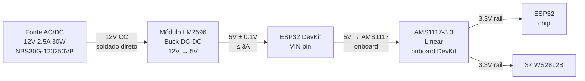

# 05_ALIMENTACAO.md — Alimentação e Distribuição de Energia

---

## 1. Identificação <a id="identificacao"></a>

| Campo | Valor |
|---|---|
| Documento | 05_alimentacao.md |
| Versão | 0.1.0 |
| Status | APROVADO |
| Pré-requisito | Deve estar APROVADO antes da criação de 02, 03, 08 e 09 |

---

## 2. Objetivo do Documento <a id="objetivo"></a>

Especificar a cadeia completa de alimentação derivada de [VER: 00_conceito.md#energizacao]: fonte externa, regulação DC-DC, rails de tensão, orçamento de corrente e capacitores de decoupling. Define as restrições de tensão e corrente que os módulos filhos devem respeitar.

---

## 3. Cadeia de Alimentação <a id="cadeia-alimentacao"></a>



**Dois estágios de regulação:**
- **Estágio 1 — LM2596 (chaveado):** eficiência ~85–90%, converte 12V → 5V
- **Estágio 2 — AMS1117 (linear):** converte 5V → 3.3V, filtra o ripple do LM2596 (PSRR ~40dB em 150kHz = atenuação ~100×)

**Decisão crítica — WS2812B em 3.3V:** LEDs alimentados no rail 3.3V (saída AMS1117). GPIO5 emite 3.3V; WS2812B a 3.3V aceita sinal a 2.31V mínimo. Sem level shifter. [VER: 03_saida_visual.md#alimentacao-led]

---

## 4. Componente LM2596 <a id="componente-lm2596"></a>

### 4.1 Opção recomendada — módulo pré-montado <a id="modulo-lm2596"></a>

| Campo | Valor |
|---|---|
| Componente | Módulo DC-DC Buck LM2596 ajustável |
| Componentes externos | Nenhum — L, D, C incluídos no módulo |
| Ajuste | Potenciômetro onboard → ajustar para 5.0V ± 0.1V com multímetro antes de conectar ESP32 |
| Corrente máxima | 3A |

### 4.2 Componentes externos (somente se usar CI isolado) <a id="ci-isolado"></a>

| Componente | Valor | Função |
|---|---|---|
| L1 — Indutor | 68–100μH, 1.5A mín | Energia do conversor buck |
| D1 — Diodo | Schottky 1N5819 ou SR360 | Roda livre do indutor |
| C_in | 100μF / 25V eletrolítico | Bulk na entrada 12V |
| C_out_bulk | 470μF / 10V eletrolítico | Bulk na saída 5V |
| C_out_hf | 100nF / 50V cerâmico | Filtra ruído HF |

---

## 5. Orçamento de Corrente <a id="orcamento-corrente"></a>

### 5.1 Carga no rail 5V <a id="carga-5v"></a>

| Componente | Corrente típica | Corrente pico | Nota |
|---|---|---|---|
| ESP32 DevKit (WiFi AP ativo) | 150mA | 240mA | Via AMS1117 onboard |
| 3× WS2812B @ 3.3V | 30mA | 120mA | setBrightness(150); pico = branco full |
| **Total** | **180mA** | **360mA** | — |

### 5.2 Margens de segurança <a id="margens"></a>

| Componente | Capacidade | Margem sobre pico |
|---|---|---|
| LM2596 (módulo) | 3A = 3000mA | 8.3× sobre 360mA |
| AMS1117 (onboard) | 800mA | 2.2× sobre 360mA |
| Fonte NBS30G-120250VB | 30W / 12V = 2500mA | 14.3× sobre 175mA de entrada |

### 5.3 Corrente na entrada 12V <a id="corrente-12v"></a>

```
P_carga    = 5V × 360mA = 1.8W
P_entrada  = 1.8W / 0.85 (efic. LM2596) = 2.1W
I_entrada  = 2.1W / 12V = 175mA de pico
Disponível = 2500mA → margem 14.3×
```

---

## 6. Capacitores de Decoupling <a id="decoupling"></a>

| Posição | Capacitor | Tipo | Função |
|---|---|---|---|
| Entrada LM2596 (12V) | 100μF / 25V | Eletrolítico | Bulk — absorve transitórios da fonte |
| Saída LM2596 (5V) | 470μF / 10V | Eletrolítico | Bulk — reduz ripple de chaveamento |
| Saída LM2596 (5V) | 100nF / 50V | Cerâmico | HF — filtra ruído de chaveamento |
| VIN do DevKit | 10μF / 16V | Eletrolítico | Bulk local para transitórios do WiFi |
| VIN do DevKit | 100nF / 50V | Cerâmico | HF local |
| VDD de cada WS2812B (×3) | 10μF / 16V | Eletrolítico | Estabiliza pico ao acender |
| VDD de cada WS2812B (×3) | 100nF / 50V | Cerâmico | HF — filtra transitórios de corrente |

Total de capacitores cerâmicos 100nF/50V: **5 unidades** (1 saída LM2596 + 1 VIN + 3 por LED).

---

## 7. Conexão Física <a id="conexao-fisica"></a>

| Campo | Valor |
|---|---|
| Fonte → LM2596 | Soldagem direta — sem conector intermediário |
| Saída LM2596 | 2 fios (+ e −) para barramento de distribuição 5V |
| Barramento | Especificação de fios: [VER: 10_cablagem.md#tabela-fios] |
| Barramento → ESP32 VIN | Via shield ou fio direto: [VER: 09_conexoes.md#cadeia-alimentacao-ascii] |

---

## 8. Restrições para Módulos Filhos <a id="restricoes-filhos"></a>

### 8.1 Para 02_sensor_impacto.md <a id="restricao-sensor"></a>
- Tensão máxima no pino ADC1: **3.3V** (rail AMS1117)
- Zener de proteção: **3.3V** — qualquer pico acima é clipado
- Ruído LM2596 atenuado ~100× pelo AMS1117 — sem impacto na leitura ADC
- [VER: 02_sensor_impacto.md#circuito-protecao]

### 8.2 Para 03_saida_visual.md <a id="restricao-led"></a>
- WS2812B alimentados em **3.3V** (pino 3V3 do DevKit = saída AMS1117)
- GPIO5 a 3.3V: compatível com WS2812B a 3.3V sem level shifter
- Brilho máximo: FastLED.setBrightness(150) → corrente máxima 120mA nos 3 LEDs
- [VER: 03_saida_visual.md#alimentacao-led]

### 8.3 Para 08_bom.md <a id="restricao-bom"></a>
- Fonte: NBS30G-120250VB (12V 2.5A 30W)
- Regulador: módulo LM2596 pré-montado (preferencial) ou CI isolado + [VER: #ci-isolado]
- Todos os capacitores de [VER: #decoupling] devem constar no BOM

### 8.4 Para 09_conexoes.md <a id="restricao-conexoes"></a>
- Cadeia: 12V → LM2596 → 5V → VIN DevKit → AMS1117 → 3.3V
- Fonte soldada diretamente ao LM2596 — sem conector intermediário
- [VER: 09_conexoes.md#visao-geral]

---

## 9. Critérios de Aceitação <a id="criterios-aceitacao"></a>

| # | Teste | Condição de aprovação |
|---|---|---|
| CA-05-01 | Tensão saída LM2596 em vazio | 5.0V ± 0.1V (ajustar potenciômetro antes de conectar ESP32) |
| CA-05-02 | Tensão saída LM2596 sob carga total | 5.0V ± 5% durante 60 min contínuos |
| CA-05-03 | Tensão rail 3.3V sob carga total | 3.3V ± 5% durante 60 min contínuos |
| CA-05-04 | Ausência de reset por brownout | Zero resets em 60 min de operação |
| CA-05-05 | Temperatura LM2596 | < 70°C após 30 min |
| CA-05-06 | Temperatura AMS1117 | < 70°C após 30 min |
| CA-05-07 | Ripple saída 5V | < 50mV pico a pico |

---

## Changelog

| Versão | Data | Seção | Mudança | Impacto em dependentes |
|---|---|---|---|---|
| 0.1.0 | 2026-06-26 | — | Criação — reescrita do zero com âncoras, _PADRAO v0.1.0, derivada de 00_conceito v0.1.0 e 01_arquitetura v0.1.0 | 02, 03, 08, 09 [OBRIGATÓRIO] |

---

## Rastreabilidade

| Tipo | Documento | Versão | Vínculo | Âncora relevante |
|---|---|---|---|---|
| Pai | _PADRAO.md | 0.1.0 | BLOQUEADOR | — |
| Pai | 00_conceito.md | 0.1.0 | BLOQUEADOR | #energizacao |
| Pai | 01_arquitetura.md | 0.1.0 | BLOQUEADOR | #hardware, #requisitos-nao-funcionais |
| Filho | 02_sensor_impacto.md | — | OBRIGATÓRIO | #restricao-sensor |
| Filho | 03_saida_visual.md | — | OBRIGATÓRIO | #restricao-led |
| Filho | 08_bom.md | — | OBRIGATÓRIO | #restricao-bom |
| Filho | 09_conexoes.md | — | OBRIGATÓRIO | #restricao-conexoes |
---

Licenca: GPL-3.0 — consulte `/LICENSE` na raiz do repositorio.
