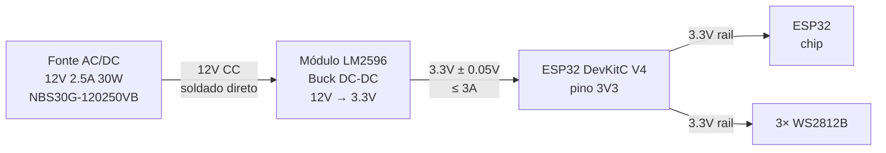

# 05_ALIMENTACAO.md — Alimentação e Distribuição de Energia

---

## 1. Identificação <a id="identificacao"></a>

| Campo | Valor |
|---|---|
| Documento | 05_alimentacao.md |
| Versão | 0.3.2 |
| Status | APROVADO |
| Pré-requisito | Deve estar APROVADO antes da criação de 02, 03, 08 e 09 |

---

## 2. Objetivo do Documento <a id="objetivo"></a>

Especificar a cadeia completa de alimentação derivada de [VER: 00_conceito.md#energizacao]: fonte externa, regulação DC-DC, rails de tensão, orçamento de corrente e capacitores de decoupling. Define as restrições de tensão e corrente que os módulos filhos devem respeitar.

---

## 3. Cadeia de Alimentação <a id="cadeia-alimentacao"></a>



**Nota sobre o AMS1117-3.3 (fora do caminho de potência):** o regulador linear
onboard do DevKit (E01) NÃO participa da cadeia de alimentação de operação. A
unidade em uso degradou (validação Fase 6, 2026-07-02: sustenta cargas leves,
mas colapsa no transitório da ligada do rádio WiFi — brownout em loop com
qualquer fonte de 5V no pino 5V). O CI permanece soldado na placa e atua
somente quando o USB alimenta o DevKit durante GRAVAÇÃO de firmware — gravação
não usa WiFi, carga leve, dentro da capacidade residual da unidade degradada.
Consequência operacional: USB-only com WiFi ativo produz brownout SEMPRE;
operação exige a fonte externa.

**Estágio único de regulação:**
- **LM2596 (chaveado):** eficiência ~85–90%, converte 12V → 3.3V direto.
- Trade-off assumido: sem o estágio linear, o ripple de chaveamento do LM2596
  não é mais atenuado pelo PSRR do AMS1117 (~40dB). Mitigação: capacitores de
  [VER: #decoupling], validação por CA-05-07 e CA-05-08, e threshold do ADC
  [CALIBRAR] calibrado com a topologia final [VER: #restricao-sensor].

**Decisão crítica — WS2812B em 3.3V:** inalterada — LEDs alimentados no rail
3.3V (agora saída direta do LM2596). GPIO5 emite 3.3V; WS2812B a 3.3V aceita
sinal a 2.31V mínimo. Sem level shifter. [VER: 03_saida_visual.md#alimentacao-led]

**Registro da decisão (formato do protocolo):**

```
DECISAO: alimentar o rail 3.3V diretamente do LM2596 ajustado a 3.30V ± 0.05V,
  removendo o AMS1117 do caminho de potência de operação.
JUSTIFICATIVA: (1) validação Fase 6 (2026-07-02) provou o AMS1117 da unidade
  incapaz de sustentar o transitório da ligada do rádio (brownout em loop;
  eliminados por evidência: firmware byte-idêntico a v0.3.0, cabo/porta USB,
  LEDs, fonte externa — diagnóstico por firmware/diag/wifi_test.cpp);
  (2) mesmo uma unidade saudável tem margem 2.2× (800mA vs 360mA de pico de
  datasheet) que se mostrou insuficiente para o transitório real de
  calibração RF pós-erase; (3) o LM2596 (3A) já existe na cadeia — margem
  8.3× sem componente novo.
FASE V-MODEL: Fase 3 (Design de Hardware), revisada pela Fase 6 (Validação).
VALIDACAO: CA-05-01 a CA-05-08 [VER: #criterios-aceitacao]; prova empírica em
  2026-07-02/03 — sistema completo operando com a topologia nova.
ANALISE DE FALHA: LM2596 desajustado acima de 3.6V destrói o ESP32 (máximo
  absoluto do datasheet) → mitigação: medição em vazio OBRIGATÓRIA antes de
  conectar (CA-05-01) + trimpot travado/marcado após ajuste; afundamento do
  rail sob transitório → brownout detector reseta o chip (comportamento
  seguro; sem corrupção de flash).
ALTERNATIVA: (a) substituir o DevKitC — mesma classe de regulador frágil, não
  corrige a causa raiz; (b) trocar o AMS1117 (solda SMD) — retrabalho de
  risco sem melhorar a margem de projeto; (c) reduzir potência TX —
  paliativo que degrada alcance sem corrigir a raiz. Descartadas.
```

---

## 4. Componente LM2596 <a id="componente-lm2596"></a>

### 4.1 Opção recomendada — módulo pré-montado <a id="modulo-lm2596"></a>

| Campo | Valor |
|---|---|
| Componente | Módulo DC-DC Buck LM2596 ajustável |
| Componentes externos | Nenhum — L, D, C incluídos no módulo |
| Ajuste | Potenciômetro onboard → ajustar para **3.30V ± 0.05V** com multímetro, **em vazio, ANTES de conectar ao pino 3V3**. Proibido conectar acima de 3.6V (máximo absoluto do ESP32). Travar/marcar o trimpot após o ajuste |
| Corrente máxima | 3A |

### 4.2 Componentes externos (somente se usar CI isolado) <a id="ci-isolado"></a>

| Componente | Valor | Função |
|---|---|---|
| L1 — Indutor | 68–100μH, 1.5A mín | Energia do conversor buck |
| D1 — Diodo | Schottky 1N5819 ou SR360 | Roda livre do indutor |
| C_in | 100μF / 25V eletrolítico | Bulk na entrada 12V |
| C_out_bulk | 470μF / 10V eletrolítico | Bulk na saída 3.3V |
| C_out_hf | 100nF / 50V cerâmico | Filtra ruído HF |

---

## 5. Orçamento de Corrente <a id="orcamento-corrente"></a>

### 5.1 Carga no rail 3.3V <a id="carga-3v3"></a>

| Componente | Corrente típica | Corrente pico | Nota |
|---|---|---|---|
| ESP32 DevKit (WiFi AP ativo) | 150mA | 240mA | Direto no rail 3.3V |
| 3× WS2812B @ 3.3V | 30mA | 120mA | setBrightness(150); pico = branco full |
| **Total** | **180mA** | **360mA** | — |

Nota da Fase 6: o transitório da ligada do rádio (calibração RF, maior no
primeiro boot pós-erase) excede o pico de datasheet por alguns ms — coberto
pelo capacitor bulk local dimensionado em [VER: #decoupling] e validado por
CA-05-08.

### 5.2 Margens de segurança <a id="margens"></a>

| Componente | Capacidade | Margem sobre pico |
|---|---|---|
| LM2596 (módulo) | 3A = 3000mA | 8.3× sobre 360mA |
| Fonte NBS30G-120250VB | 30W / 12V = 2500mA | 21× sobre 117mA de entrada |

(O AMS1117 saiu do caminho de potência — a margem 2.2× dele deixou de ser a
restrição do sistema; ver nota em [VER: #cadeia-alimentacao].)

### 5.3 Corrente na entrada 12V <a id="corrente-12v"></a>

```
P_carga    = 3.3V × 360mA = 1.19W
P_entrada  = 1.19W / 0.85 (efic. LM2596) = 1.4W
I_entrada  = 1.4W / 12V = 117mA de pico
Disponível = 2500mA → margem 21×
```

---

## 6. Capacitores de Decoupling <a id="decoupling"></a>

| Posição | Capacitor | Tipo | Função |
|---|---|---|---|
| Entrada LM2596 (12V) | 100μF / 25V | Eletrolítico | Bulk — absorve transitórios da fonte (soldado no módulo) |
| Saída LM2596 (3.3V) | 470μF / 10V | Eletrolítico | Bulk — reduz ripple de chaveamento (soldado no módulo) |
| Saída LM2596 (3.3V) | 100nF / 50V | Cerâmico | HF — filtra ruído de chaveamento |
| Pino 3V3 do DevKitC V4 | 1000μF / ≥10V | Eletrolítico | Bulk local — cobre o transitório da ligada do rádio enquanto a malha de controle do LM2596 responde (~1ms): C ≥ 0.35A × 1ms / 0.35V ≈ 1000μF. Validado empiricamente na Fase 6 (2026-07-03) |
| Pino 3V3 do DevKitC V4 | 100nF / 50V | Cerâmico | HF local |
| VDD de cada WS2812B (×3) | 10μF / 16V | Eletrolítico | Estabiliza pico ao acender |
| VDD de cada WS2812B (×3) | 100nF / 50V | Cerâmico | HF — filtra transitórios de corrente |

Total de capacitores cerâmicos 100nF/50V: **5 unidades** (1 saída LM2596 + 1 pino 3V3 + 3 por LED).

---

## 7. Conexão Física <a id="conexao-fisica"></a>

| Campo | Valor |
|---|---|
| Fonte → LM2596 | Soldagem direta — sem conector intermediário |
| Saída LM2596 | 2 fios (+ e −) para barramento de distribuição 3.3V |
| Barramento | Especificação de fios: [VER: 10_cablagem.md#tabela-fios] |
| Barramento → pino 3V3 DevKitC V4 | Via shield ou fio direto: [VER: 09_conexoes.md#cadeia-alimentacao-ascii] |
| USB do DevKitC | Somente para gravação de firmware (sem WiFi ativo) — nunca como alimentação de operação |

---

## 8. Restrições para Módulos Filhos <a id="restricoes-filhos"></a>

### 8.1 Para 02_sensor_impacto.md <a id="restricao-sensor"></a>
- Tensão máxima no pino ADC1: **3.3V** (rail 3.3V — saída direta do LM2596)
- Zener de proteção: **3.3V** — qualquer pico acima é clipado
- Ripple do LM2596 chega ao rail 3.3V atenuado apenas pelos capacitores de
  [VER: #decoupling] (sem o PSRR do AMS1117) — o threshold do ADC é
  [CALIBRAR] e DEVE ser calibrado com a topologia final energizada
- [VER: 02_sensor_impacto.md#circuito-protecao]

### 8.2 Para 03_saida_visual.md <a id="restricao-led"></a>
- WS2812B alimentados em **3.3V** (rail 3.3V = saída direta do LM2596)
- GPIO5 a 3.3V: compatível com WS2812B a 3.3V sem level shifter
- Brilho máximo: FastLED.setBrightness(150) → corrente máxima 120mA nos 3 LEDs
- [VER: 03_saida_visual.md#alimentacao-led]

### 8.3 Para 08_bom.md <a id="restricao-bom"></a>
- Fonte: NBS30G-120250VB (12V 2.5A 30W)
- Regulador: módulo LM2596 pré-montado ajustado a 3.30V ± 0.05V (preferencial)
  ou CI isolado + [VER: #ci-isolado]
- Todos os capacitores de [VER: #decoupling] devem constar no BOM

### 8.4 Para 09_conexoes.md <a id="restricao-conexoes"></a>
- Cadeia: 12V → LM2596 (3.30V) → pino 3V3 DevKitC V4 → rail 3.3V
- Fonte soldada diretamente ao LM2596 — sem conector intermediário
- USB somente para gravação de firmware — nunca alimentação de operação
- [VER: 09_conexoes.md#visao-geral]

---

## 9. Critérios de Aceitação <a id="criterios-aceitacao"></a>

| # | Teste | Condição de aprovação |
|---|---|---|
| CA-05-01 | Tensão saída LM2596 em vazio | 3.30V ± 0.05V (ajustar potenciômetro ANTES de conectar ao pino 3V3; proibido conectar acima de 3.6V) |
| CA-05-02 | Tensão saída LM2596 sob carga total | 3.3V ± 5% durante 60 min contínuos |
| CA-05-03 | Tensão no pino 3V3 do DevKitC sob carga total | 3.3V ± 5% durante 60 min contínuos (inclui queda nas junções fio/borne) |
| CA-05-04 | Ausência de reset por brownout | Zero resets em 60 min de operação |
| CA-05-05 | Temperatura LM2596 | < 70°C após 30 min |
| CA-05-06 | OBSOLETO (v0.3.0) — AMS1117 fora do caminho de potência | — |
| CA-05-07 | Ripple no rail 3.3V | < 50mV pico a pico |
| CA-05-08 | Boot com rádio: 10 ciclos consecutivos de boot com init WiFi, incluindo o 1º boot pós-erase (calibração RF completa) | Zero brownouts nos 10 ciclos |

---

## Changelog

| Versão | Data | Seção | Mudança | Impacto em dependentes |
|---|---|---|---|---|
| 0.1.0 | 2026-06-26 | — | Criação — reescrita do zero com âncoras, _PADRAO v0.1.0, derivada de 00_conceito v0.1.0 e 01_arquitetura v0.1.0 | 02, 03, 08, 09 [OBRIGATÓRIO] |
| 0.2.0 | 2026-06-30 | #cadeia-alimentacao | Adiciona nota explícita: AMS1117-3.3 é o regulador onboard do DevKit (E01), não componente externo; não consta no BOM nem em etapas de montagem | 02, 03, 08, 09 [PATCH depende_de] |
| 0.2.1 | 2026-07-01 | depende_de, Rastreabilidade | Atualiza referência 01_arquitetura.md v0.1.0→v0.2.0 (bump MINOR retroativo) | 02, 03, 08, 09 |
| 0.2.2 | 2026-07-01 | #cadeia-alimentacao, #decoupling, #conexao-fisica, #restricao-conexoes | Substitui rótulo "VIN" por "pino 5V" — ESP32 DevKitC V4 rotula o pino de entrada 5V como "5V", não "VIN"; atualiza depende_de 01_arquitetura.md v0.2.0→v0.2.1 | 02, 03, 08, 09 |
| 0.3.0 | 2026-07-03 | #cadeia-alimentacao, #componente-lm2596, #orcamento-corrente, #decoupling, #conexao-fisica, #restricoes-filhos, #criterios-aceitacao | Arquitetura de alimentação revisada pela Fase 6: LM2596 ajustado a 3.30V ± 0.05V alimenta o rail 3.3V direto; AMS1117 (unidade degradada, comprovado 2026-07-02) fora do caminho de potência; USB somente gravação; bulk 1000µF no pino 3V3; âncora #carga-5v renomeada para #carga-3v3 (sem referências externas); CA-05-01/02/03/07 revisados, CA-05-06 OBSOLETO, CA-05-08 novo. NOTA: mudança de arquitetura classificaria bump MAJOR; mantido MINOR por decisão de projeto — MAJOR consolidado no fechamento do V-model | 02, 03, 08, 09 [OBRIGATÓRIO] |
| 0.3.1 | 2026-07-03 | depende_de, Rastreabilidade | Cascata do conceito v0.2.0 (exportação CSV+PDF com pré-visualização, M2/M3 validados): atualiza referências — 00_conceito.md v0.1.0→v0.2.0, 01_arquitetura.md v0.2.1→v0.3.0 | — |
| 0.3.2 | 2026-07-03 | depende_de, Rastreabilidade | Cascata do registro do manual do pedagogo (12_manual_pedagogo.md no impacta de 00 e 07): atualiza referências — 00_conceito.md v0.2.0→v0.2.1, 01_arquitetura.md v0.3.0→v0.3.1 | — |

---

## Rastreabilidade

| Tipo | Documento | Versão | Vínculo | Âncora relevante |
|---|---|---|---|---|
| Pai | _PADRAO.md | 0.1.0 | BLOQUEADOR | — |
| Pai | 00_conceito.md | 0.2.1 | BLOQUEADOR | #energizacao |
| Pai | 01_arquitetura.md | 0.3.1 | BLOQUEADOR | #hardware, #requisitos-nao-funcionais |
| Filho | 02_sensor_impacto.md | — | OBRIGATÓRIO | #restricao-sensor |
| Filho | 03_saida_visual.md | — | OBRIGATÓRIO | #restricao-led |
| Filho | 08_bom.md | — | OBRIGATÓRIO | #restricao-bom |
| Filho | 09_conexoes.md | — | OBRIGATÓRIO | #restricao-conexoes |
---

Licenca: GPL-3.0 — consulte `/LICENSE` na raiz do repositorio.
