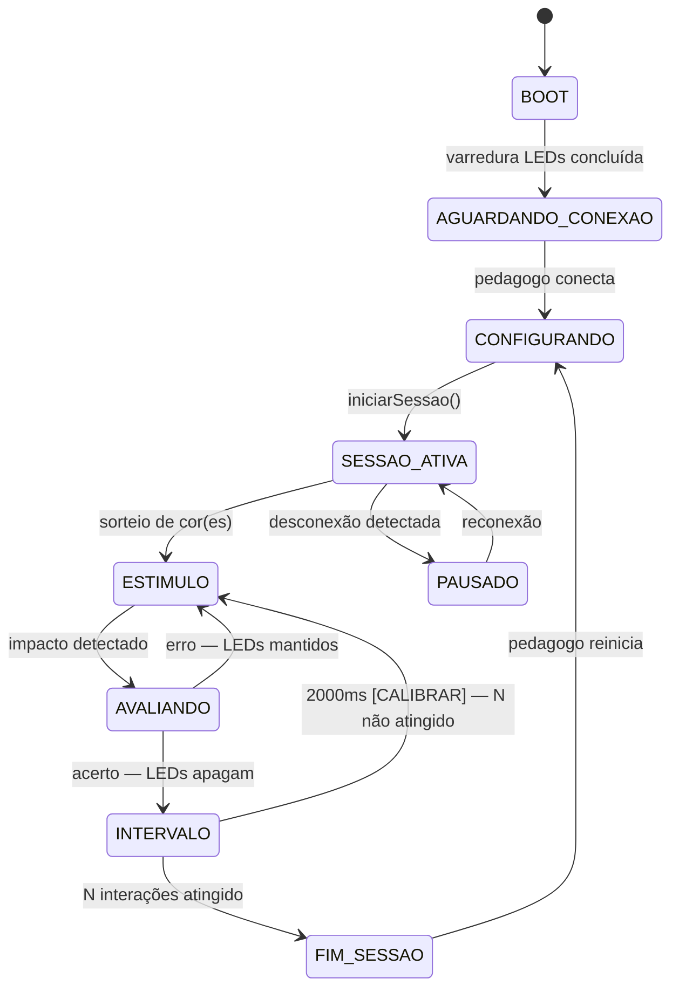

# 01_ARQUITETURA.md — Arquitetura do Sistema

---

## 1. Identificação <a id="identificacao"></a>

| Campo | Valor |
|---|---|
| Documento | 01_arquitetura.md |
| Versão | 0.1.0 |
| Status | APROVADO |
| Escopo | Decisões de sistema que todos os módulos devem seguir |

---

## 2. Objetivo do Documento <a id="objetivo"></a>

Traduzir os requisitos de [VER: 00_conceito.md#componentes-fisicos], [VER: 00_conceito.md#modos-operacao] e [VER: 00_conceito.md#regras-sistema] em decisões técnicas vinculantes: stack de software, decomposição em módulos, interfaces entre módulos, mapeamento de GPIOs e requisitos não-funcionais. Todo documento de módulo (02, 03, 04, 05, 07) deriva deste documento como fonte única de verdade técnica.

---

## 3. Stack Tecnológico Obrigatório <a id="stack-tecnologico"></a>

| Camada | Tecnologia | Justificativa |
|---|---|---|
| IDE / Build | PlatformIO + Arduino framework | Gestão de dependências reproduzível; sem conflito de bibliotecas |
| Sensor | FastLED ≥ 3.6 | Protocolo WS2812B, controle de brilho, animações |
| Web server | ESPAsyncWebServer | Non-blocking; suporta WebSocket sem travar loop |
| Protocolo evento | WebSocket (full-duplex) | Latência < 200ms ESP32 → browser; sem polling |
| Interface pedagogo | HTML + CSS + JS puro | Zero dependência externa; offline-first; sem framework |
| Armazenamento | localStorage do browser | Dados no dispositivo do pedagogo; ESP32 stateless |

Nenhuma biblioteca fora desta lista pode ser adicionada sem atualizar este documento e seus dependentes.

---

## 4. Hardware de Referência <a id="hardware"></a>

| Componente | Especificação | Fixo? |
|---|---|---|
| Microcontrolador | ESP32-WROOM-32U, 38 pinos | Sim |
| Shield | Placa de expansão compatível com ESP32 38 pinos | Sim |
| LEDs | 3× WS2812B individuais (não fita) | Sim |
| Sensores | 4× disco piezoelétrico 27mm, sem PCB | Sim |
| Alimentação | Ver [VER: 05_alimentacao.md#cadeia-alimentacao] | — |

---

## 5. Decomposição em Módulos de Firmware <a id="modulos-firmware"></a>

O firmware é dividido em 4 módulos com responsabilidade única. Nenhum módulo acessa hardware do outro.

### 5.1 MOD_SENSOR <a id="mod-sensor"></a>
- **Responsabilidade:** leitura dos 4 piezos via ADC, detecção de impacto, debounce
- **Produz:** eventos `{ zona: LARANJA|AZUL|AMARELO|ROXO }` para MOD_JOGO
- **Não decide:** se o impacto é acerto ou erro — isso é responsabilidade de MOD_JOGO
- **Documento:** [VER: 02_sensor_impacto.md#algoritmo-deteccao]

### 5.2 MOD_LED <a id="mod-led"></a>
- **Responsabilidade:** controle dos 3 WS2812B, animações de boot e celebração
- **Recebe:** comandos `{ led: CENTRAL|ESQUERDO|DIREITO, cor: LARANJA|AZUL|AMARELO|ROXO|OFF }` de MOD_JOGO
- **Não decide:** qual cor acender nem quando — isso é responsabilidade de MOD_JOGO
- **Documento:** [VER: 03_saida_visual.md#mapeamento-led]

### 5.3 MOD_JOGO <a id="mod-jogo"></a>
- **Responsabilidade:** máquina de estados, lógica de acerto/erro, aleatoriedade, score, sequência de interações
- **Recebe:** eventos de MOD_SENSOR e comandos de MOD_WIFI
- **Produz:** comandos para MOD_LED e eventos de resultado para MOD_WIFI
- **Documento:** [VER: 04_logica_jogo.md#identificacao]

### 5.4 MOD_WIFI <a id="mod-wifi"></a>
- **Responsabilidade:** Access Point, servidor HTTP, WebSocket, envio de eventos ao browser
- **Recebe:** eventos de resultado de MOD_JOGO
- **Produz:** comandos de sessão para MOD_JOGO (configuração pré-sessão, pause, retomar)
- **Documento:** [VER: 07_interface_pedagogo.md#identificacao]

---

## 6. Interfaces entre Módulos <a id="interfaces-modulos"></a>

Todas as interfaces são por callback ou fila de eventos. Proibido acesso direto a variáveis globais de outro módulo.

### 6.1 MOD_SENSOR → MOD_JOGO <a id="interface-sensor-jogo"></a>

```cpp
struct EventoImpacto {
  enum class Zona { LARANJA, AZUL, AMARELO, ROXO };
  Zona zona;
  uint32_t timestamp_ms;
};
// Callback registrado por MOD_JOGO:
void onImpacto(EventoImpacto evento);
```

### 6.2 MOD_JOGO → MOD_LED <a id="interface-jogo-led"></a>

```cpp
struct ComandoLED {
  enum class LED { CENTRAL, ESQUERDO, DIREITO, TODOS };
  enum class Cor  { LARANJA, AZUL, AMARELO, ROXO, OFF };
  LED led;
  Cor cor;
};
void setLED(ComandoLED cmd);
```

### 6.3 MOD_JOGO ↔ MOD_WIFI <a id="interface-jogo-wifi"></a>

```cpp
// MOD_WIFI → MOD_JOGO (configuração e controle)
struct ConfigSessao {
  String nome_crianca;
  uint8_t n_interacoes;
  enum class Modo { UM_MARTELO, DOIS_MARTELOS } modo;
  enum class Mecanismo { A_SHUFFLE, B_PESO } mecanismo;
  uint16_t janela_ms;   // Timing B, padrão 800ms
};
void iniciarSessao(ConfigSessao cfg);
void pausarSessao();
void retomarSessao();

// MOD_JOGO → MOD_WIFI (resultados)
struct EventoResultado {
  enum class Tipo { ACERTO, ERRO, FIM_SESSAO };
  Tipo tipo;
  uint8_t acertos;
  uint8_t total;
  uint32_t duracao_ms;
};
void onResultado(EventoResultado resultado);
```

---

## 7. Mapeamento de GPIOs <a id="mapeamento-gpios"></a>

| Função | GPIO | Tipo | Canal ADC | Restrição |
|---|---|---|---|---|
| Piezo Laranja | 34 | Input-only | ADC1_CH6 | ADC1 obrigatório — ADC2 incompatível com WiFi |
| Piezo Azul | 35 | Input-only | ADC1_CH7 | ADC1 obrigatório |
| Piezo Amarelo | 32 | Input/Output | ADC1_CH4 | ADC1 obrigatório |
| Piezo Roxo | 33 | Input/Output | ADC1_CH5 | ADC1 obrigatório |
| Dados WS2812B | 5 | Output | — | Pino de dados único para cadeia de 3 LEDs |

**Pinos reservados — não usar:**
- GPIO 6–11: flash SPI interno
- GPIO 12: strapping, afeta boot se HIGH
- ADC2 (GPIO 0, 2, 4, 13–15, 25–27): incompatível com WiFi ativo

---

## 8. Requisitos Não-Funcionais <a id="requisitos-nao-funcionais"></a>

Derivados de [VER: 00_conceito.md#fluxo-interacao] e [VER: 00_conceito.md#feedback].

| ID | Requisito | Limite | Origem |
|---|---|---|---|
| RNF-01 | Latência impacto → LED resposta | < 50ms | Experiência responsiva; budget: 10ms detecção + 40ms LED |
| RNF-02 | Latência evento → tela pedagogo | < 200ms | WebSocket; aceitável para feedback visual |
| RNF-03 | Falsos positivos por sessão | 0 aceitáveis | [VER: 00_conceito.md#definicao-erro] |
| RNF-04 | Operação offline total | Obrigatório | [VER: 00_conceito.md#conectividade] |
| RNF-05 | Browser compatível | Qualquer browser mobile moderno | [VER: 00_conceito.md#conectividade] |
| RNF-06 | GPIOs de leitura | Exclusivamente ADC1 | [VER: #mapeamento-gpios] |
| RNF-07 | Framework externo na interface | Proibido | [VER: #stack-tecnologico] |

---

## 9. Diagrama de Estados do Sistema <a id="diagrama-estados"></a>



---

## 10. Critérios de Aceitação de Sistema <a id="criterios-aceitacao"></a>

| # | Teste | Condição de aprovação |
|---|---|---|
| CA-01-01 | Boot completo | LEDs varrem 3×4 cores sem erro; hotspot visível em < 5s |
| CA-01-02 | Conexão pedagogo | Browser conecta e carrega interface em < 3s |
| CA-01-03 | Latência impacto→LED | Medida com osciloscópio: < 50ms em 10 amostras |
| CA-01-04 | Latência evento→tela | Inspeção visual: feedback aparece < 200ms após impacto |
| CA-01-05 | Sessão completa Modo 1 | N=5: 5 interações completam, tela de resultados exibida |
| CA-01-06 | Sessão completa Modo 2 | N=5: idem com dois martelos |
| CA-01-07 | Desconexão e retomada | Desligar WiFi do pedagogo: ESP32 pausa; reconectar: retoma |
| CA-01-08 | Exportação CSV | Arquivo gerado com cabeçalho e dados corretos |

---

## Changelog

| Versão | Data | Seção | Mudança | Impacto em dependentes |
|---|---|---|---|---|
| 0.1.0 | 2026-06-26 | — | Criação — reescrita do zero derivada de 00_conceito v0.1.0 com âncoras e _PADRAO v0.1.0 | Todos os módulos filhos |

---

## Rastreabilidade

| Tipo | Documento | Versão | Vínculo | Âncora relevante |
|---|---|---|---|---|
| Pai | _PADRAO.md | 0.1.0 | BLOQUEADOR | — |
| Pai | 00_conceito.md | 0.1.0 | BLOQUEADOR | #publico-alvo, #componentes-fisicos, #modos-operacao, #fluxo-interacao, #regras-sistema, #feedback, #interface-pedagogo, #gestao-dados |
| Filho | 05_alimentacao.md | — | OBRIGATÓRIO | #hardware |
| Filho | 02_sensor_impacto.md | — | OBRIGATÓRIO | #mod-sensor, #mapeamento-gpios, #requisitos-nao-funcionais |
| Filho | 03_saida_visual.md | — | OBRIGATÓRIO | #mod-led, #mapeamento-gpios, #requisitos-nao-funcionais |
| Filho | 04_logica_jogo.md | — | OBRIGATÓRIO | #mod-jogo, #interface-sensor-jogo, #interface-jogo-led, #interface-jogo-wifi, #requisitos-nao-funcionais, #diagrama-estados |
| Filho | 07_interface_pedagogo.md | — | OBRIGATÓRIO | #mod-wifi, #interface-jogo-wifi, #stack-tecnologico, #requisitos-nao-funcionais |
| Filho | 08_bom.md | — | OBRIGATÓRIO | #hardware, #mapeamento-gpios |
| Filho | 09_conexoes.md | — | OBRIGATÓRIO | #hardware, #mapeamento-gpios |
---

Licenca: GPL-3.0 — consulte `/LICENSE` na raiz do repositorio.
